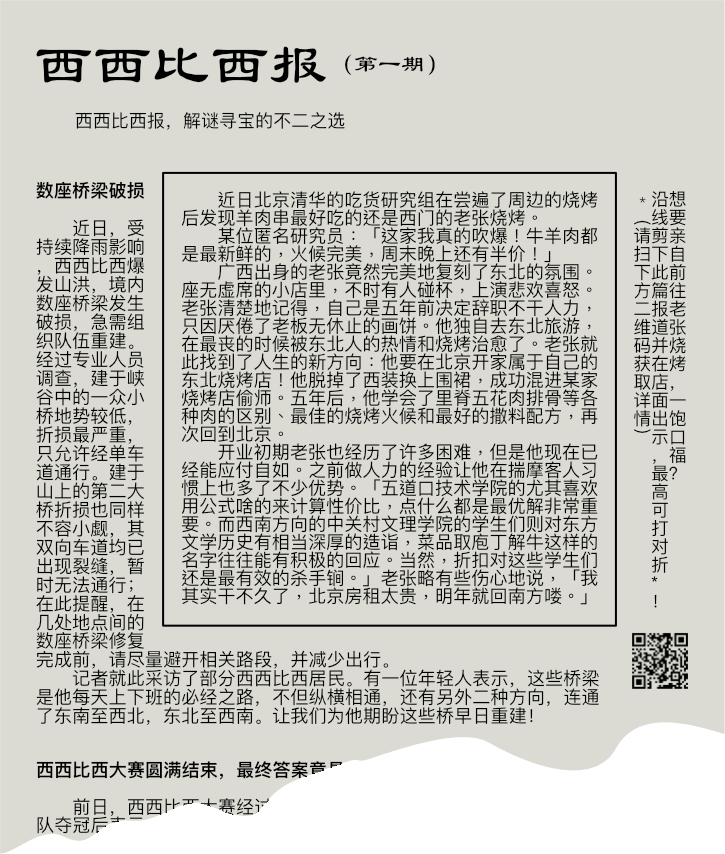
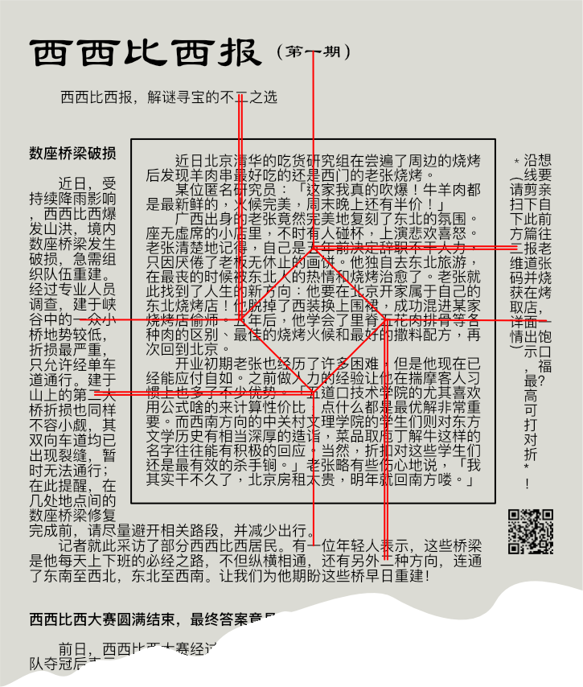
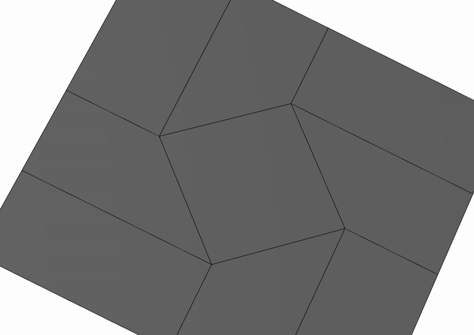
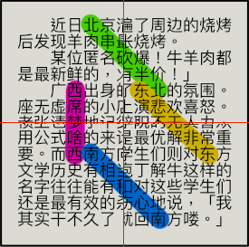

# 指南树

## 题面

@{##u##}看到温姐站在指南树下，@{##ta##}走了过去，发现温姐正在研究着一张报纸。「虽然我们得到了指南树指引方向，但是不知道目的地又有什么用呢？」

她把手里的报纸交给@{##u##}：「或许你能看出些什么？」

## 解题后内容

@{##u##}突然明白过来，没有目的地的旅程，只是漂泊；有了中心思想，才有了有意义的前行。至于那中心思想是什么，就在每个人的心中了……

## 答案

`中心思想`

## 解析

根据“数座桥梁”和“另外二种方向，连通了东南至西北，东北至西南”的提示，我们可以得知这是一道允许八个方向相连的数桥变种题。数桥的线索就是出现在报纸里的所有数字，解得：

此外根据指南区meta答案 `NEWSPAPER FOLDING`，“剪下此报道”，“谷中的一……单车道”“山上的第二……双向车道”，我们可以得知这是一道折纸题，剪下中间的正方形后，将数桥解的单线作谷折，双线作山折：

折完只剩四个角可见：

此时注意到东南西北成对出现，并且中间都隔了三个字（中间的一个字是由折叠后拼接而成）为简单字谜，按照 NEWS 的顺序有：

- 北：串砍半，“中”
- 东：悲无非，“心”
- 西：席梦啥：“思”
- 南：相和心：“想”

连起来就是这题的答案`中心思想`。

## 提示

### 1. 我毫无头绪

根据报纸上出现的数字解数桥，数桥除了水平垂直外还包括斜着的两个方向，注意有些数字在方框之外。

### 2. 我解开了第一步的【数据删除】题，但是不知道下一步

根据“剪下此篇报道”和“谷中的一……单车道”“山上的第二……双向车道”，对中间正方形部分进行折纸。

### 3. 我进行了【数据删除】的操作，不知道下一步

注意东南西北四个字各出现两次，并且每对之间有三个字。

## 本地附件

- [0afbd03a82574a588f6333f471c4e625.webp](../../../assets/static.cipherpuzzles.com/static/images/0afbd03a82574a588f6333f471c4e625.webp)
- [2a6b215c850a424b9a5b4563eff846af.webp](../../../assets/static.cipherpuzzles.com/static/images/2a6b215c850a424b9a5b4563eff846af.webp)
- [94c8777beece430b8c0cc9020e385069.webp](../../../assets/static.cipherpuzzles.com/static/images/94c8777beece430b8c0cc9020e385069.webp)
- [def9a3e4265440089c30ef11ff5fa314.webp](../../../assets/static.cipherpuzzles.com/static/images/def9a3e4265440089c30ef11ff5fa314.webp)
- [df25055280854e76840be2b7d0e32dbe.gif](../../../assets/static.cipherpuzzles.com/static/images/df25055280854e76840be2b7d0e32dbe.gif)

来源：[https://ccbc16.cipherpuzzles.com/data/puzzles/51.json](https://ccbc16.cipherpuzzles.com/data/puzzles/51.json)
