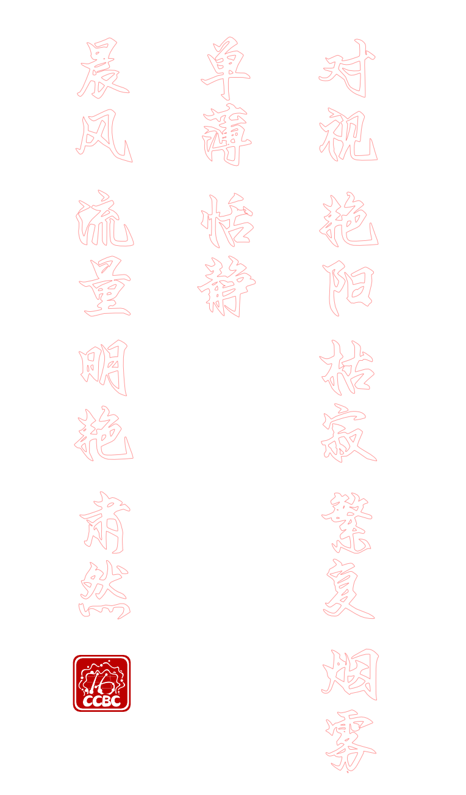

# 印刷树

## 题面

ES走到树边，对@{##u##}说道：「这就是传说中的印刷树了，相传这棵树长成后，割开树皮就能取得五色缤纷的墨水，用这种墨水印刷出来的题目永不可能出错……咦，我为什么要说题目？」

@{##u##}若有所思：「居然有这么神奇的墨水吗……」



## 交互源码

### html

```html

```


## 解题后内容

@{##u##}突然明白过来，这种神奇的墨水原来子虚乌有。确实，怎么可能用了某种墨水就能保证永不出错呢？奇迹从来都不存在，只有靠自己的细心和努力。

## 答案

`子虚乌有`

## 解析

图片里的红字像是书法描红的字帖，对应印刷区meta的答案`THE MISSING INK`。缺少的墨水和FT里的“五色”合在一起可以搜到墨分五色：焦、浓、重、淡、清，而观察题目里的字则可发现每个字恰好可以跟这五个字之一组词：
<style>
#ink_sol th {
width: 100px;
text-align: left;
}
</style>
<table id="ink_sol">
<tr><th>组词</th><th></th><th>排序</th><th></th><th>棋盘字母</th></tr>
<tr><td>对焦</td><td>重视</td><td>1</td><td>3</td><td>C</td></tr>
<tr><td>浓艳</td><td>重阳</td><td>2</td><td>3</td><td>H</td></tr>
<tr><td>枯焦</td><td>清寂</td><td>1</td><td>5</td><td>E</td></tr>
<tr><td>繁重</td><td>重复</td><td>3</td><td>3</td><td>N</td></tr>
<tr><td>浓烟</td><td>浓雾</td><td>2</td><td>2</td><td>G</td></tr>
<tr><td>清单</td><td>淡薄</td><td>5</td><td>4</td><td>Y</td></tr>
<tr><td>恬淡</td><td>清静</td><td>4</td><td>5</td><td>U</td></tr>
<tr><td>清晨</td><td>清风</td><td>5</td><td>5</td><td>Z</td></tr>
<tr><td>清流</td><td>重量</td><td>5</td><td>3</td><td>X</td></tr>
<tr><td>清明</td><td>浓艳</td><td>5</td><td>2</td><td>W</td></tr>
<tr><td>肃清</td><td>淡然</td><td>5</td><td>4</td><td>Y</td></tr>
</table>

将焦、浓、重、淡、清这五个字分别对应1-5后，用棋盘密码可以提取得 CHENG YU（成语） ZXWY，指的便是以 ZXWY 开头的成语`子虚乌有`，也就是本题答案。

## 提示

### 1. 我毫无头绪

每个字都可以跟墨水的五色之一组词。

### 2. 要用什么版本的【数据删除】啊？

需要用的是拼音首字母为JNZDQ的版本。

### 3. 该如何提取？

以J为1，Q为5，用棋盘密码翻译成英文字母，可以得到一句提示，用中文理解。


## 本地附件

- [1bf7699b3b784c60afcf247342e17fea.webp](../../../assets/static.cipherpuzzles.com/static/images/1bf7699b3b784c60afcf247342e17fea.webp)
- [4b809a7366904078858da34b565f9449.webp](../../../assets/static.cipherpuzzles.com/static/images/4b809a7366904078858da34b565f9449.webp)

来源：[https://ccbc16.cipherpuzzles.com/data/puzzles/52.json](https://ccbc16.cipherpuzzles.com/data/puzzles/52.json)
