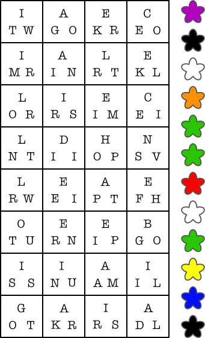
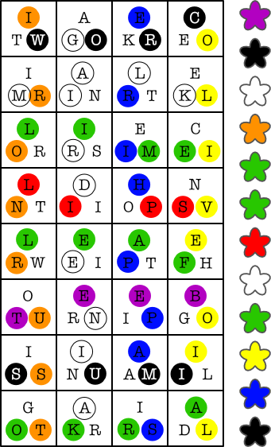
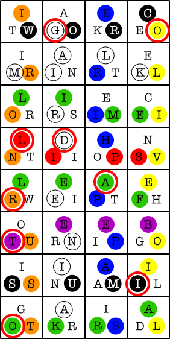

# 火药树

## 题面

<div  class="error-block custom-block">
<span class="custom-block-title">修改于 2025/08/12 15:18</span>
<span>增加了【注意有可能是从右到左/从下往上】题目描述</span>
</div>

@{##u##}见到7k+正在招呼@{##ta##}过去。7k+惊奇地说：「你居然种出了火药树！这实在是个奇迹，我们要用最华丽的烟花来庆祝！我这里有个配方倒是很适合，就是焰色怎么也调不对。@{##u##}，你能一起研究下吗？」

## 交互源码

### html

```html
<p>每行和每列各有一个单词/词组，注意有可能是从右到左/从下往上。</p>



<p>（四）
```


## 解题后内容

@{##u##}突然明白过来，要做出最好看的烟花，就要在燃料里加入正确比例的黄金，不能因为太多而显得俗气，也不能因为太少而有失身份。@{##u##}找到7k+的配方，计算出了正确的黄金比例，终于做出了低调又不失奢华的黄金烟火。

## 答案

`黄金比例`

## 解析

首先可以在矩阵里找到一些有明确颜色的物品的词，为了方便确认，所有的词对应的颜色按照字母表顺序给出：

- 紫：BEET
- 黑：CROW
- 白：GARDENIA
- 橙：IRON RUST
- 绿：LEAF
- 绿：LIME
- 红：LIPS
- 白：MILK
- 绿：OKRA
- 黄：OLIVE OIL
- 蓝：SAPPHIRE
- 黑：SUMI



读未用到的字母得到 TAKE INTERSECTION WITH ORIGINAL GRID。这里 original grid 指的是火药区 meta 所用到的颜色格子：


这里 intersection （相交）指的是看字母颜色和格子颜色一致的位置，例如第一行第二格在火药 meta 里为白色，提取其中同为白色的字母 G（来自gardenia）。



从上到下提取的字母为 GOLD RATIO，根据字数提示（四）可以翻译成最终答案`黄金比例`。

## 提示

### 1. 我得到了一句很长的英文提示，但是不知道如何理解

提取本题图里符合【那句英语提示】的字母。这里【相交】指的是**颜色**和原网格一致。

### 2. 我毫无头绪

首先要找出8行4列共12个词（可能有倒序的！）。这些词可以对应右边的颜色。

### 3. 该如何提取

每组三字母在确定行列单词后会有两个字母【染上对应单词颜色】，结合那句很长的提示，和火药区meta中的焰色进行操作。

### 4. 请直接告诉我【很长的英文提示】是什么

take intersection with original grid


## 中间答案

| 提交 | 回复 | 附加信息 |
| --- | --- | --- |
| GOLD RATIO | 这是一个里程碑 |  |
| TAKE INTERSECTION WITH ORIGINAL GRID | 这是正确的 |  |

## 本地附件

- [27c05cbaff194912b9ffb4752f468c57.webp](../../../assets/static.cipherpuzzles.com/static/images/27c05cbaff194912b9ffb4752f468c57.webp)
- [3b9f7681fa8a48aeba709b4167b98232.webp](../../../assets/static.cipherpuzzles.com/static/images/3b9f7681fa8a48aeba709b4167b98232.webp)
- [460c85c5de9949549cd7b404ba900008.webp](../../../assets/static.cipherpuzzles.com/static/images/460c85c5de9949549cd7b404ba900008.webp)
- [7847cd97b0ab4a1d94166ac4d6237097.webp](../../../assets/static.cipherpuzzles.com/static/images/7847cd97b0ab4a1d94166ac4d6237097.webp)
- [fa2fee421750424a96ad498edf9ccc74.webp](../../../assets/static.cipherpuzzles.com/static/images/fa2fee421750424a96ad498edf9ccc74.webp)

来源：[https://ccbc16.cipherpuzzles.com/data/puzzles/53.json](https://ccbc16.cipherpuzzles.com/data/puzzles/53.json)
