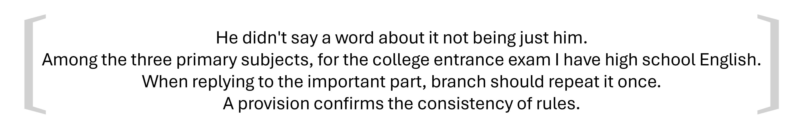

# 造纸树

## 题面

@{##u##}看到叶子站在树边，递来一张纸条：「据说这是西方传来的造纸秘诀，我看不懂这是什么，可以翻译一下吗？」

## 解题后内容

@{##u##}突然明白过来，前人的知识已经在@{##ta##}脑海里形成了思维定势！我们没有必要追求西方造纸树的种法，要想达到最高的文化造纸水平，就一定得自树一帜，不落窠臼！

## 答案

`自树一帜`

## 解析

本题对应造纸meta的答案「寻回文化造纸」。根据题目的要求，将英文翻译成中文，并使得结果尽量回文。

<table id="answerkey">
<tr><th>英文</th><th>中文翻译</th><th>多余汉字</th></tr>
<tr><td>He didn't ...</td><td>他是只字不提不只是他。</td><td>字</td></tr>
<tr><td>Among the ...</td><td>语数英中，高考我考高中英语。</td><td>数</td></tr>
<tr><td>When replying ...</td><td>回复重要部分时，分部要重复一回。</td><td>一</td></tr>
<tr><td>A provision ...</td><td>一则规定确定规则一致。</td><td>致</td></tr>
</table>

得到「字数一致」。注意图片两侧的括号是「你说话带括号」中的同音记号〔〕。因此答案为与「字数一致」同音的成语「自树一帜」。

## 提示

### 1. 翻译了也不知道该做什么！

“寻回文化造纸”其实是在提示本题翻译后的内容都几乎是“回文”。

### 2. 我得到了中间答案但是然后呢？

注意图片两侧的括号是「你说话带括号」中的同音记号〔〕，所以你需要找一个跟这四个字谐音的成语。

### 3. 我知道该做什么了，但是我做不出来，能给一些提示吗？

以下是每句话的长度和中心二字：
10 “不提”
12 “考我”
14 “时分”
10 “确定”

## 中间答案

| 提交 | 回复 | 附加信息 |
| --- | --- | --- |
| 字数一致 | 这是一个里程碑。 |  |

## 本地附件

- [4fbf4f48abcb44cf95347ccf156af94b.webp](../../../assets/static.cipherpuzzles.com/static/images/4fbf4f48abcb44cf95347ccf156af94b.webp)
- [785327eda61a4afc82b5c8208cb154ae.webp](../../../assets/static.cipherpuzzles.com/static/images/785327eda61a4afc82b5c8208cb154ae.webp)

来源：[https://ccbc16.cipherpuzzles.com/data/puzzles/54.json](https://ccbc16.cipherpuzzles.com/data/puzzles/54.json)
