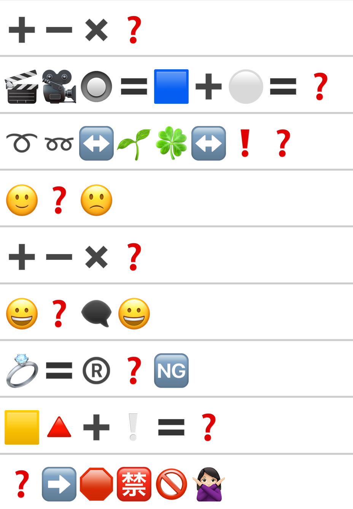

# 恶魔斯基

## 题面

<div class="tip-block custom-block">
  <span class="custom-block-title">💡</span>
  <span>本题可在emoji后的输入框中输入内容</span>
</div>

## 交互源码

### html

```html


<div>
    方便复制版：
    <pre>
➕➖✖️❓
🎬🎥🔘🟰🟦➕⚪🟰❓
➰➿↔️🌱🍀↔️❗❓
🙂❓🙁
➕➖✖️❓
😀❓🗨️😀
💍🟰®️❓🆖
🟨🔺➕❕🟰❓
❓➡️🛑🈲🚫🙅🏻‍♀
    </pre>
</div>
```

- javascript: [../../../assets/static.cipherpuzzles.com/static/images/dd2e194821774c3d8f9473d1659f100b.vue](../../../assets/static.cipherpuzzles.com/static/images/dd2e194821774c3d8f9473d1659f100b.vue)

### backend_c16-emoji

```text
// 恶魔斯基

// @ts-check

//在后端脚本中，可以使用全局变量 ctx
//全局变量 ctx 的内容如下：
// request: string; // 从前端调用时，前端传来的请求对象，内容为JSON字符串。请调用JSON.parse转换后使用。
// uid: number; // 当前调用此后端脚本的用户 uid
// username: string; //当前调用此后端脚本的用户名
// gid: number; // 当前调用此后端脚本的组队 gid
// getStatus(key: string) : string // 读取：当前用户的状态存储（注意状态信息是加密存储在每个浏览器上的，不同用户的不同进程都有不同的状态）
// setStatus(key: string, value: string) // 写入：当前用户的状态存储
// getProgress(pid: number, key: string) : string // 读取：当前组队的题目进度（组队题目进度是存在后端数据库中的，组队内部共享，每个题目有不同的状态）
// setProgress(pid: number, key: string, value: string) // 写入：当前组队的题目进度
// getStorage(key: string) : string // 读取：全局状态存储。存储在服务器后端。
// setStorage(key: string, value: string) // 写入：全局状态存储。存储在服务器后端。
// getPuzzleData(pid: number) : string // 获取题目的data片段（题目详情中<data></data>中的内容）
// costCredit(gid: number, cost: number) : boolean // 扣减组队的能量点数。返回是否扣减成功。
// response(body: string) // 返回给前端的数据对象。内容为JSON字符串。必须调用JSON.stringify后传入。**必须**在此脚本中至少调用这个函数一次，即使你没什么需要返回的，也请调用一次 ctx.response("{}");
// ===================
// 下面的是一些特殊功能用的函数。尽量少用
// getGroupName(gid: number) : string // 返回给定的GID的队伍名
// getRankAndWinner(gid: number) : { rank: number; champion: string } // 返回给定的GID的队伍的完赛排名以及冠军队伍名称 
// httpPostForm(url: string, form: object, headers: object) : string // 由后端发出HTTP POST请求，调用指定的URL。form为请求参数。

const PID = 8;
//const LEVEL_ANSWER = [0, 100, 200, 300];


//在这个函数中实现你的功能，ctx定义如顶部注释，request为已解析好的传入对象。
/**
 * @param {Ctx} ctx 全局上下文对象
 * @param {object} request 用户请求
 * @returns {object} response 返回给用户的数据
 */
const puzzles = [
{ puz: "➕➖✖️❓", ans: "➗"},
{ puz: "🗽🇺🇸↔️🗼❓", ans: "🇯🇵"},
{ puz: "➰➿↔️🌱🍀↔️❗❓", ans: "‼️"},
{ puz: "🙂❓🙁", ans: "😐"},
{ puz: "➕➖✖️❓", ans: "➗"},
{ puz: "😀❓🗨️😀", ans: "💬"},
{ puz: "💍🟰®️❓🆖", ans: "ℹ️"},
{ puz: "🟨🔺➕❕🟰❓", ans: "⚠️"},
{ puz: "❓➡️🛑🈲🚫🙅🏻‍♀", ans: "⛔️"},
];

function normalizeEmoji(emoji) {
    return emoji.replace(/\uFE0F/g,'');
}

function main(ctx, request) {
    let solved = parseInt(ctx.getStatus("EmojiProblemSolved"));

    // if (ctx.uid == 3) {
    //     ctx.setStatus("EmojiProblemSolved", "0")
    // }

    if (!solved) {
        solved = 0
    }
    if (request.type === 0) {
    } else if (request.type === 1) {
        // checking answer
        if (normalizeEmoji(puzzles[solved].ans) == normalizeEmoji(request.lastAnswer)) {
            solved++;
            ctx.setStatus(("EmojiProblemSolved"), solved)
        }
    }

    let ret = []
    for (let i = 0; (i < solved+1) && (i < puzzles.length); i++) {
        ret.push(puzzles[i])
        if (i == solved) {
            ret[i].ans = ""
        }
    }

    if (request.type === 1 && solved === 9) {
        ctx.addAnswerLog(ctx.uid, ctx.gid, PID, "", 8, `已完成全部小题`);
    }

    //将你需要返回给前端的对象return出去
    return {
        puzzles: ret,
        solved: solved,
    }
}

//=======以下是JSON解析与调用脚本，一般不需要修改========
/**
 * @param {Ctx} ctx 全局上下文对象
 */
function _jsonProcessHelper(ctx) {
    let request = JSON.parse(ctx.request);
    let resBody = main(ctx, request);
    let resString = JSON.stringify(resBody);
    ctx.response(resString);
}

_jsonProcessHelper(ctx);
```


## 答案

`RECURSANT`

## 解析

<style>
@font-face {
  font-family: 'EmojiFont';
  src: url('../../../assets/static.cipherpuzzles.com/static/images/emoji.ttf') format('truetype');
}

.emoji {
  font-family: 'EmojiFont', sans-serif;
}

#answerkey {
    border-collapse: collapse;
    border-spacing: 0
}
#answerkey th {
    text-align: center;
    font-weight: bold;
    vertical-align: middle;
    padding: 3px 10px;
}
#answerkey td {
    border-style: solid none;
    border-width: thin;
    text-align: center;
    vertical-align: middle;
    padding: 3px 9px;
}
</style>

每条线索均需填入一个EMOJI。正如标题在“EMOJI”中插入了“摩斯”，根据EMOJI中的点线对应摩斯电码，转换即可得到答案。

<table id="answerkey" class="emoji">
<tr><th>线索</th><th>答案</th><th>摩斯电码</th><th>对应字母</th></tr>
<tr><td>➕➖✖️❓</td><td>➗</td><td>.-.</td><td>R</td></tr>
<tr><td>🗽🇺🇸↔️🗼❓</td><td>🇯🇵</td><td>.</td><td>E</td></tr>
<tr><td>➰➿↔️🌱🍀↔️❗❓</td><td>‼️</td><td>-.-.</td><td>C</td></tr>
<tr><td>🙂❓🙁</td><td>😐</td><td>..-</td><td>U</td></tr>
<tr><td>➕➖✖️❓</td><td>➗</td><td>.-.</td><td>R</td></tr>
<tr><td>😀❓🗨️😀</td><td>💬</td><td>...</td><td>S</td></tr>
<tr><td>💍🟰®️❓🆖</td><td>ℹ️</td><td>.-</td><td>A</td></tr>
<tr><td>🟨🔺➕❕🟰❓</td><td>⚠️</td><td>-.</td><td>N</td></tr>
<tr><td>❓➡️🛑🈲🚫🙅🏻‍♀</td><td>⛔</td><td>-</td><td>T</td></tr>
</table>

答案为 <font color = green>RECURSANT</font>

## 提示

### 1. 答完了但不知道怎么提取！

正如标题在“EMOJI”中插入了“摩斯”，需要根据填入EMOJI中的点线对应摩斯电码。


## 本地附件

- [1b4260d135a1401a84c9063917577f3e.webp](../../../assets/static.cipherpuzzles.com/static/images/1b4260d135a1401a84c9063917577f3e.webp)
- [33dbd56935a24ef3befb6521f006c7a5.webp](../../../assets/static.cipherpuzzles.com/static/images/33dbd56935a24ef3befb6521f006c7a5.webp)
- [d59da9aefed14adf9939d1702a4aea14.woff2](../../../assets/static.cipherpuzzles.com/static/images/d59da9aefed14adf9939d1702a4aea14.woff2)
- [dd2e194821774c3d8f9473d1659f100b.vue](../../../assets/static.cipherpuzzles.com/static/images/dd2e194821774c3d8f9473d1659f100b.vue)
- [emoji.ttf](../../../assets/static.cipherpuzzles.com/static/images/emoji.ttf)

来源：[https://ccbc16.cipherpuzzles.com/data/puzzles/8.json](https://ccbc16.cipherpuzzles.com/data/puzzles/8.json)
