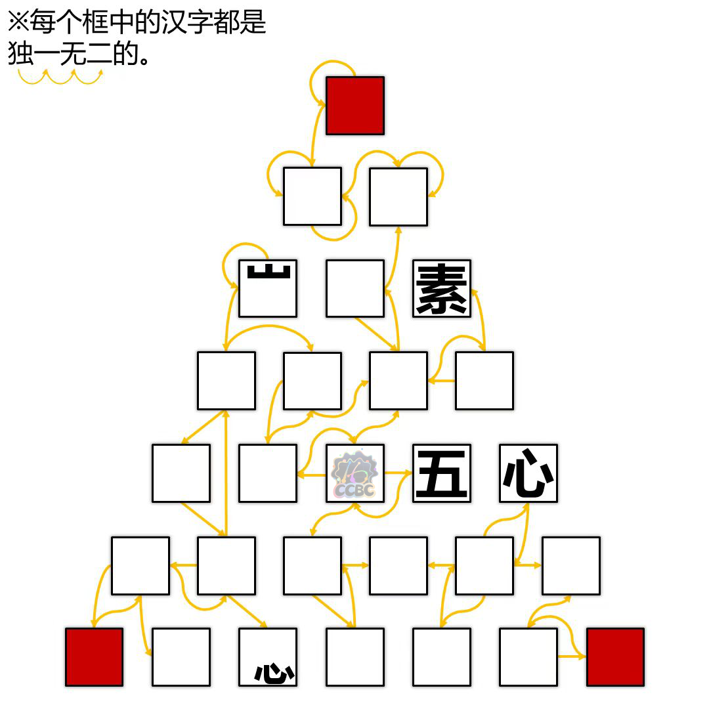
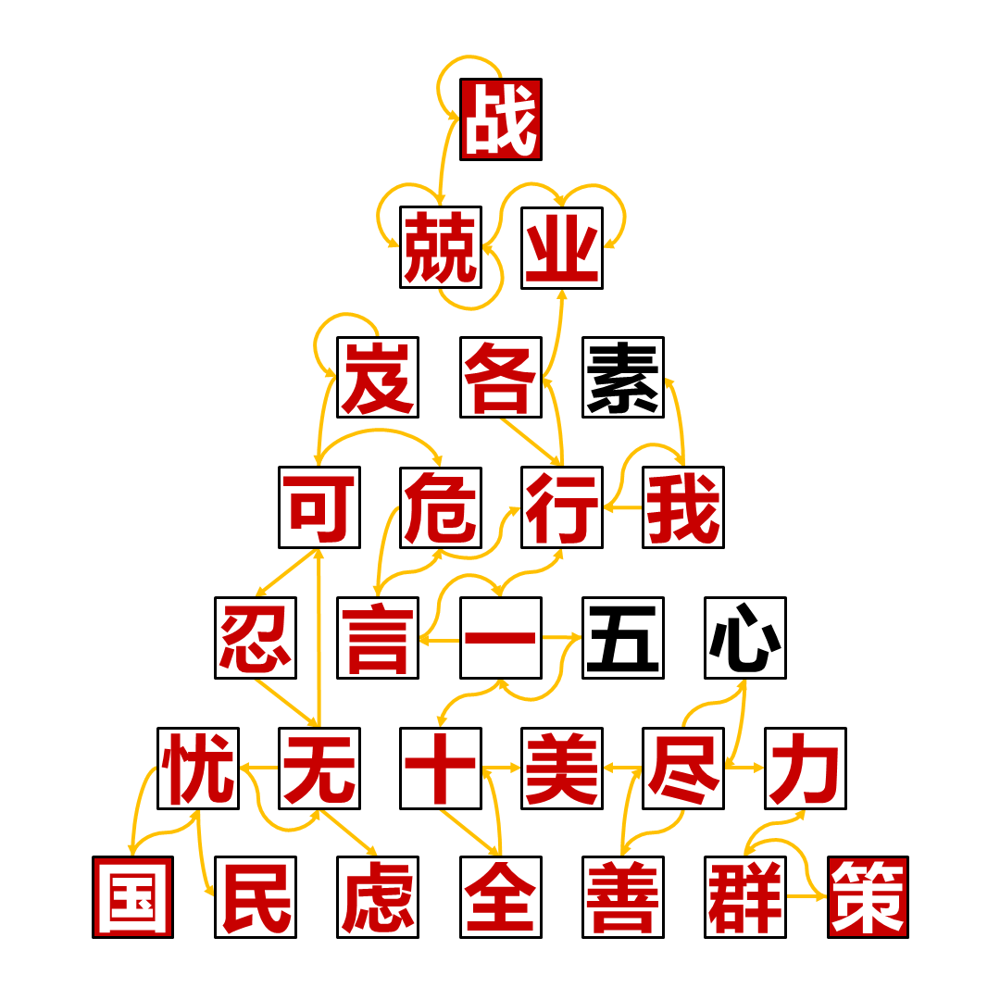

# 相辅相成

## 题面

_官方存档未提供可提取的文字题面；请查看下方附件或交互源码。_

## 交互源码

### html

```html

<style>
.pimg {
    width: 700px;
}
@media (max-width: 740px) {
    .pimg {
        width: 100%;
    }
}
</style>
```


## 答案

`战国策`

## 解析

根据左上角的提示，每组黄色箭头都指向一个成语，可以填完这个格子得到：



提取三个角的红框字得到答案`战国策`。

## 提示

### 1. 我毫无头绪

每串黄色箭头指的四个字是一个成语。


## 本地附件

- [3ab9513633fc426e9b7ee3d3fb920e17.webp](../../../assets/static.cipherpuzzles.com/static/images/3ab9513633fc426e9b7ee3d3fb920e17.webp)
- [660e44e73c2e4116947488f411f1f848.webp](../../../assets/static.cipherpuzzles.com/static/images/660e44e73c2e4116947488f411f1f848.webp)
- [6b1474f0a5f64cf9b5bca9011b0303ac.webp](../../../assets/static.cipherpuzzles.com/static/images/6b1474f0a5f64cf9b5bca9011b0303ac.webp)

来源：[https://ccbc16.cipherpuzzles.com/data/puzzles/9.json](https://ccbc16.cipherpuzzles.com/data/puzzles/9.json)
