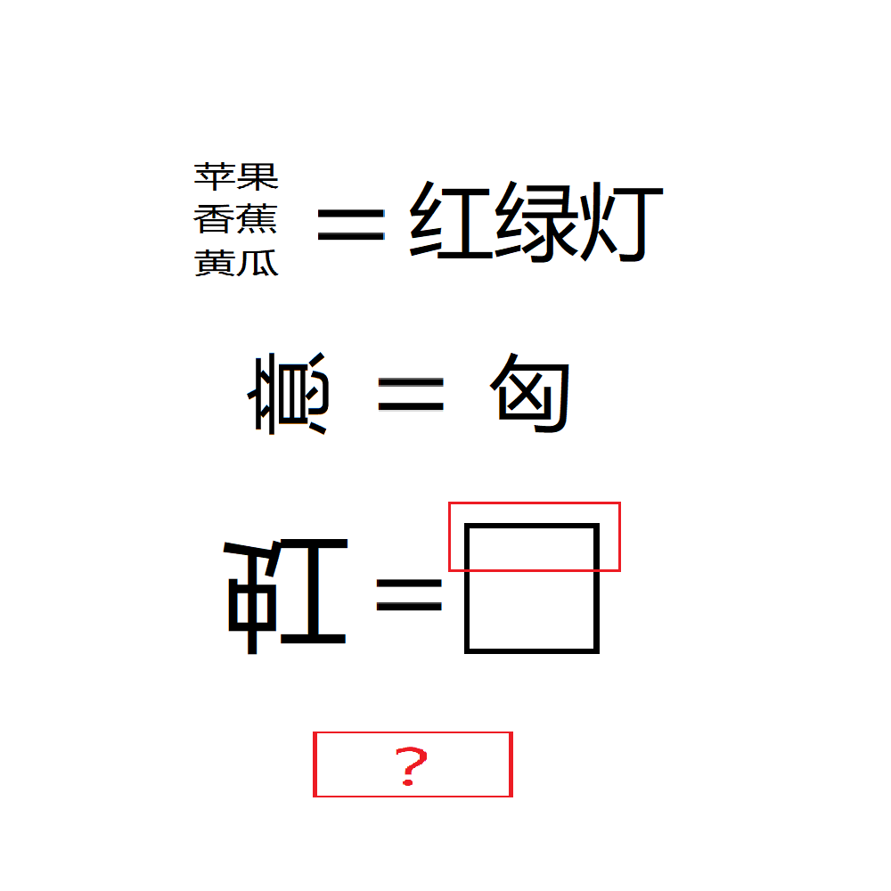

# 千字谜子题 100

## 题面

## 答案

`雨`

## 解析

第一行提示本题的字对应该事物的颜色；
第二行提示旋转汉字代表同样旋转其颜色排布；
霓的颜色排列和虹对称，因此倒置的虹就是霓，其上半部分为雨字头；
因此本题答案为雨。

## 本地附件

- [3bcbbe3553cf4cbdb32323259d8be9fb.webp](../../../assets/static.cipherpuzzles.com/static/images/3bcbbe3553cf4cbdb32323259d8be9fb.webp)

来源：[https://ccbc16.cipherpuzzles.com/data/c16-qian-puzzle.json#cid=100](https://ccbc16.cipherpuzzles.com/data/c16-qian-puzzle.json#cid=100)
