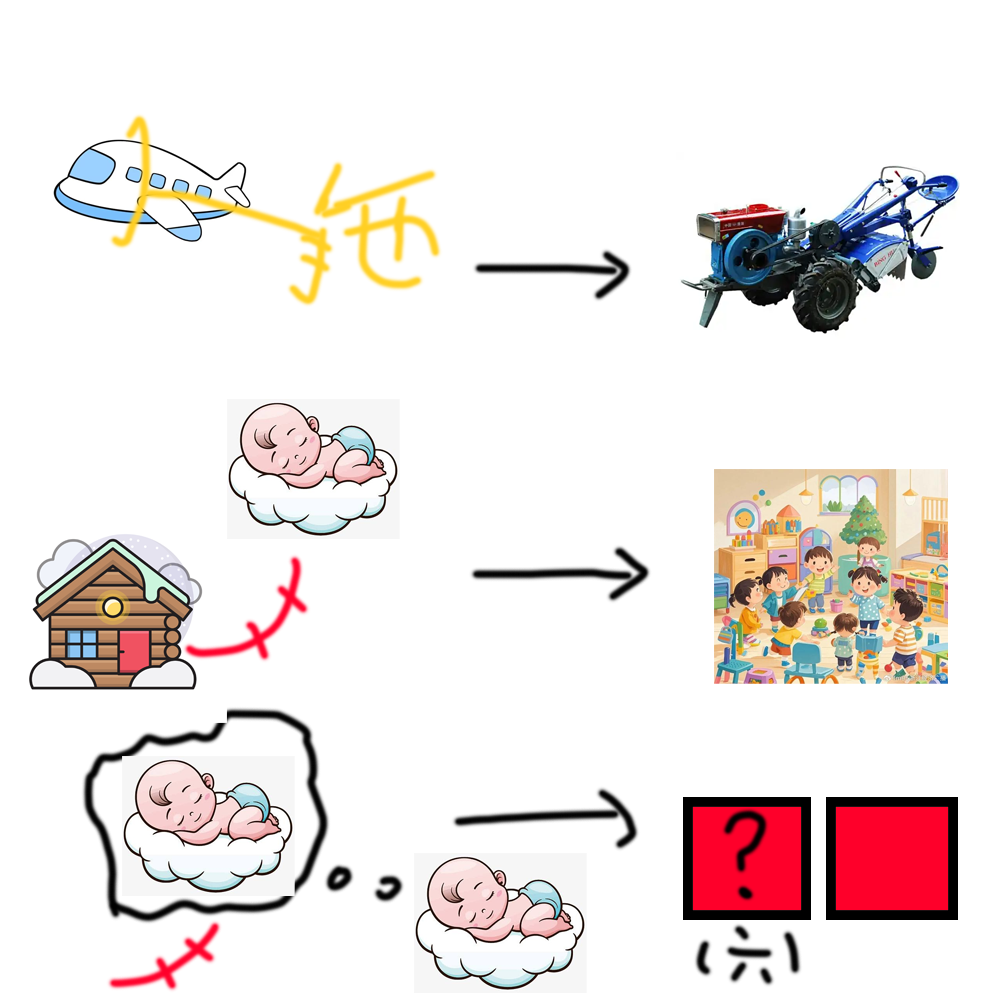

# 千字谜子题 101

## 题面

## 答案

`托`

## 解析

拖“拉”机
托儿所
托“梦”
回答问号中内容（六笔）
答案为托

卡一个小时了，求求给我们过吧，可怜

## 本地附件

- [6b3963b22b3343d9abf0fb1707830c62.webp](../../../assets/static.cipherpuzzles.com/static/images/6b3963b22b3343d9abf0fb1707830c62.webp)

来源：[https://ccbc16.cipherpuzzles.com/data/c16-qian-puzzle.json#cid=101](https://ccbc16.cipherpuzzles.com/data/c16-qian-puzzle.json#cid=101)
