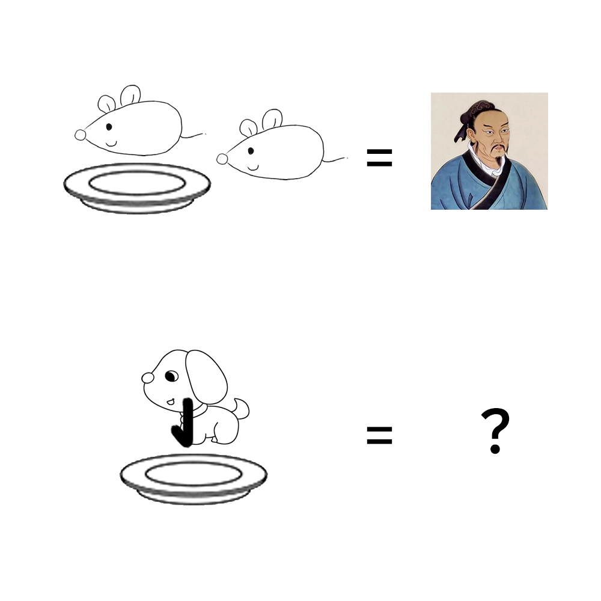

# 千字谜子题 102

## 题面

## 答案

`盛`

## 解析

识图搜索可知人物为孟子，由此可以推断鼠代表“子”（对应生肖），盘子代表“皿”，故下面的狗代表“戌”，加上图中的竖钩得到最终答案“盛”。

## 本地附件

- [484ba05e97ba40e3b6ea5ceee7459481.webp](../../../assets/static.cipherpuzzles.com/static/images/484ba05e97ba40e3b6ea5ceee7459481.webp)

来源：[https://ccbc16.cipherpuzzles.com/data/c16-qian-puzzle.json#cid=102](https://ccbc16.cipherpuzzles.com/data/c16-qian-puzzle.json#cid=102)
