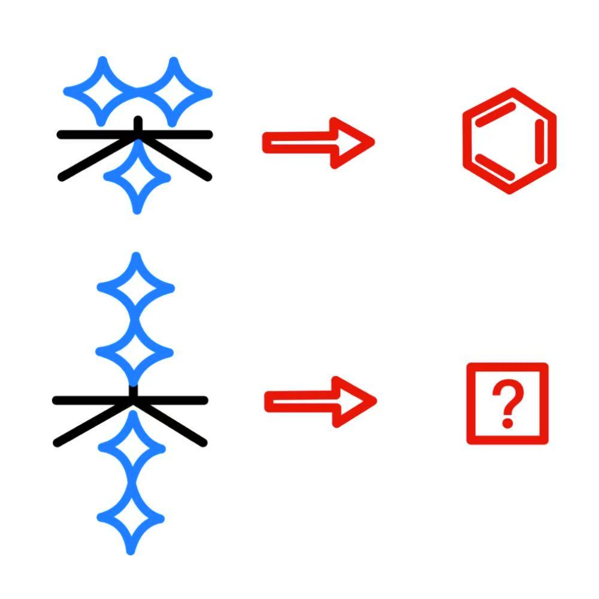

# 千字谜子题 103

## 题面

## 答案

`奉`

## 解析

上面（miàn）是苯
苯→⌬
奉→奉
另外，此题难度低于叶子戏最低难度
题目为造不出纸来怨四方谜特供版

## 本地附件

- [ad974b160f1c46269967c45d66093f1b.webp](../../../assets/static.cipherpuzzles.com/static/images/ad974b160f1c46269967c45d66093f1b.webp)

来源：[https://ccbc16.cipherpuzzles.com/data/c16-qian-puzzle.json#cid=103](https://ccbc16.cipherpuzzles.com/data/c16-qian-puzzle.json#cid=103)
