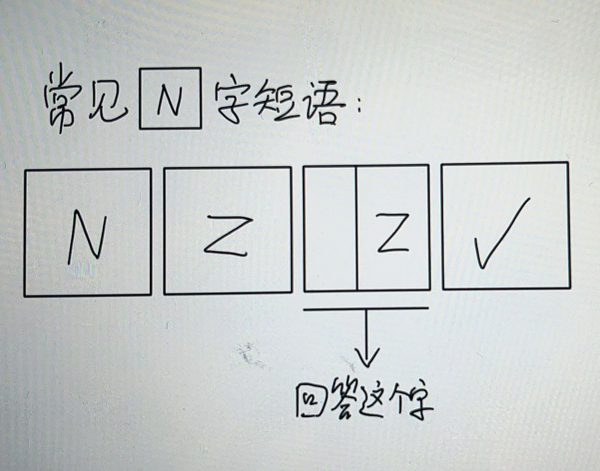

# 千字谜子题 104

## 题面

## 答案

`相`

## 解析

题目提示N对应的字为“四”，Z为N旋转过后的字，即“目”，故这个四字成语为“四目相对”，答案为“相”

## 本地附件

- [ab59bc2889b242b8af32dcd800c2f06e.webp](../../../assets/static.cipherpuzzles.com/static/images/ab59bc2889b242b8af32dcd800c2f06e.webp)

来源：[https://ccbc16.cipherpuzzles.com/data/c16-qian-puzzle.json#cid=104](https://ccbc16.cipherpuzzles.com/data/c16-qian-puzzle.json#cid=104)
