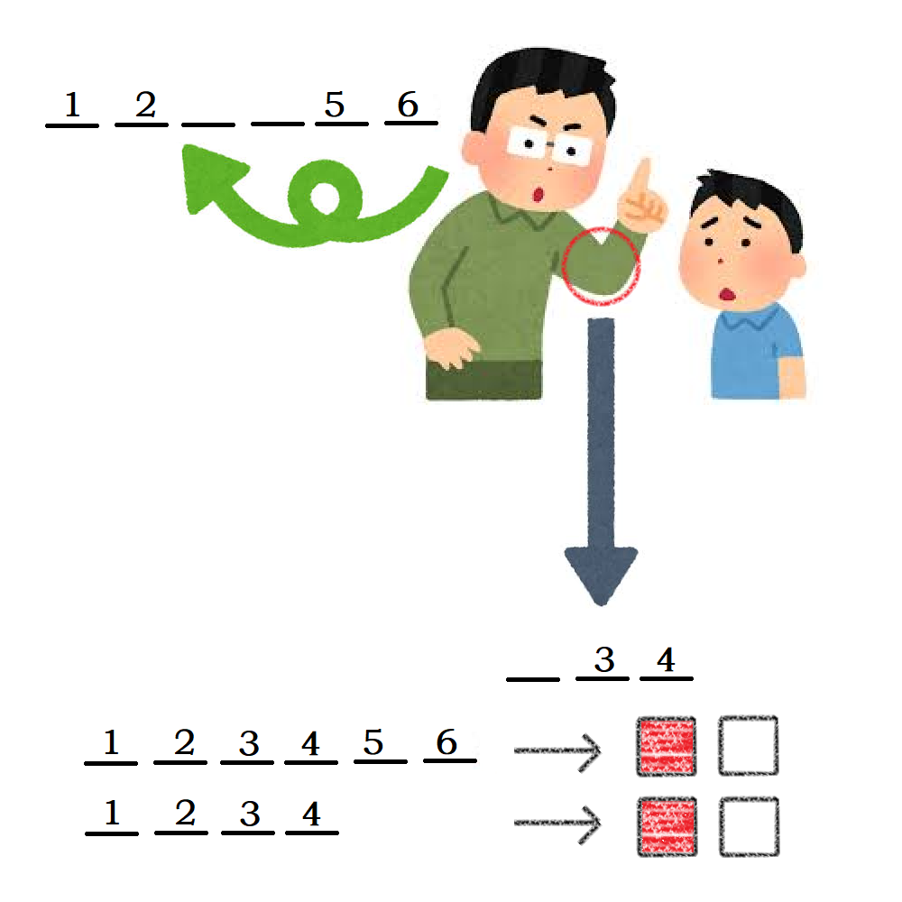

# 千字谜子题 105

## 题面

## 答案

`农`

## 解析

father arm -> 农民/农场

## 本地附件

- [74013276f4f74214aeaab5c417085f22.webp](../../../assets/static.cipherpuzzles.com/static/images/74013276f4f74214aeaab5c417085f22.webp)

来源：[https://ccbc16.cipherpuzzles.com/data/c16-qian-puzzle.json#cid=105](https://ccbc16.cipherpuzzles.com/data/c16-qian-puzzle.json#cid=105)
