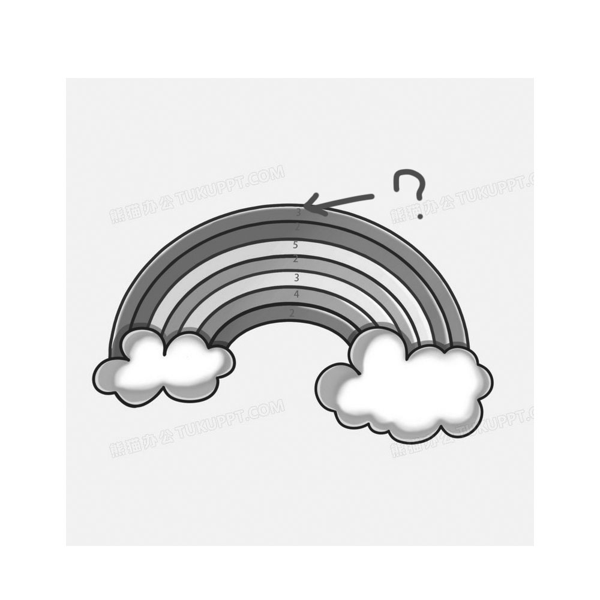

# 千字谜子题 106

## 题面

## 答案

`赤`

## 解析

彩虹拼音，用字母数限制唯一答案为“赤”

## 本地附件

- [6fad12b4f50d415ca35f7bef5bc9c011.webp](../../../assets/static.cipherpuzzles.com/static/images/6fad12b4f50d415ca35f7bef5bc9c011.webp)

来源：[https://ccbc16.cipherpuzzles.com/data/c16-qian-puzzle.json#cid=106](https://ccbc16.cipherpuzzles.com/data/c16-qian-puzzle.json#cid=106)
