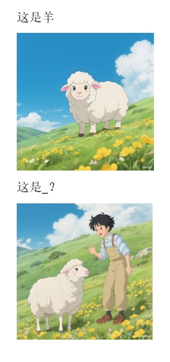

# 千字谜子题 108

## 题面

（八）

## 答案

`详`

## 解析

解析方式，偏旁提取，答案单字

## 本地附件

- [42b749546e8e4e9b97ae46d65e065493.webp](../../../assets/static.cipherpuzzles.com/static/images/42b749546e8e4e9b97ae46d65e065493.webp)

来源：[https://ccbc16.cipherpuzzles.com/data/c16-qian-puzzle.json#cid=108](https://ccbc16.cipherpuzzles.com/data/c16-qian-puzzle.json#cid=108)
