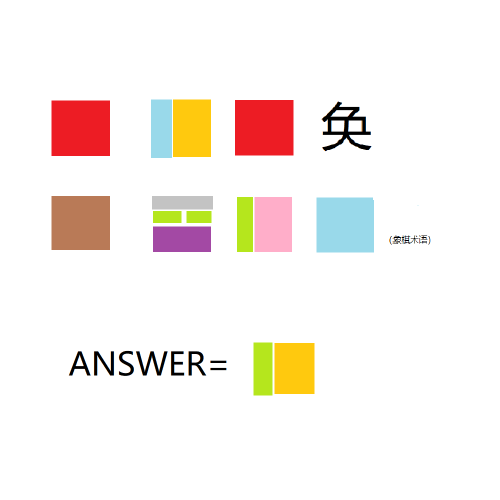

# 千字谜子题 109

## 题面

## 答案

`伦`

## 解析

第一个词美轮美奂，第二个词丢卒保车

## 本地附件

- [341e13be5b764cd1b7e479be3c799089.webp](../../../assets/static.cipherpuzzles.com/static/images/341e13be5b764cd1b7e479be3c799089.webp)

来源：[https://ccbc16.cipherpuzzles.com/data/c16-qian-puzzle.json#cid=109](https://ccbc16.cipherpuzzles.com/data/c16-qian-puzzle.json#cid=109)
