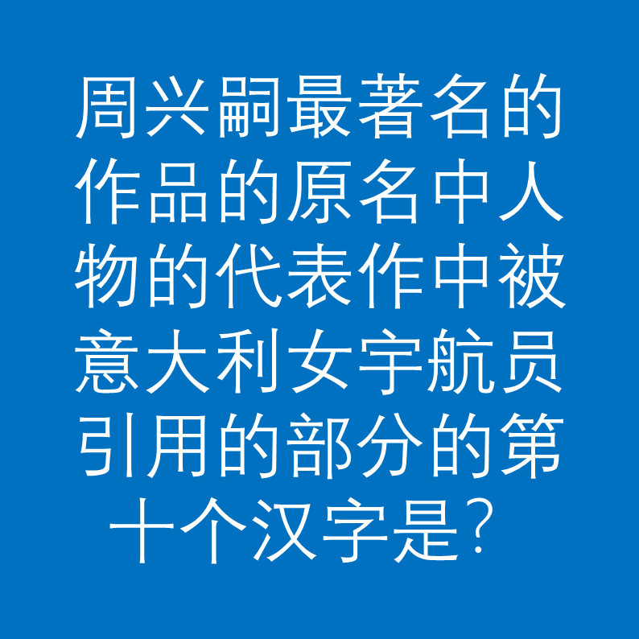

# 千字谜子题 11

## 题面

## 答案

`类`

## 解析

_官方存档未填写解析。_

## 本地附件

- [898164444f3d43f392b1fdfe4ff6007a.webp](../../../assets/static.cipherpuzzles.com/static/images/898164444f3d43f392b1fdfe4ff6007a.webp)

来源：[https://ccbc16.cipherpuzzles.com/data/c16-qian-puzzle.json#cid=11](https://ccbc16.cipherpuzzles.com/data/c16-qian-puzzle.json#cid=11)
