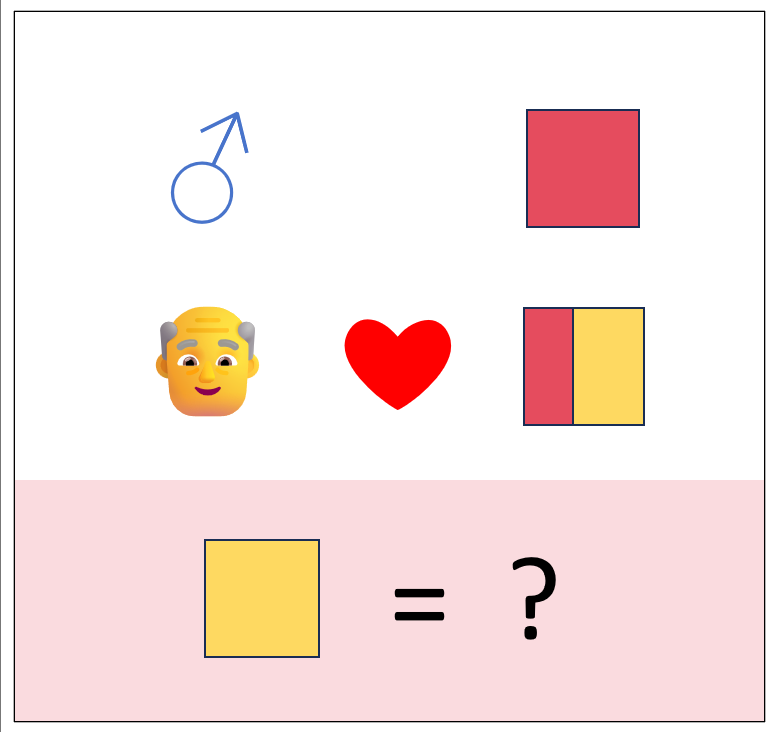

# 千字谜子题 110

## 题面

## 答案

`乃`

## 解析

爷爷爱奶奶，爷爷头上的是男生符号，奶奶头上的是女生符号，是个女，所以奶去掉女就是乃

## 本地附件

- [bcbee6a53acf497b93cbca5478a92934.webp](../../../assets/static.cipherpuzzles.com/static/images/bcbee6a53acf497b93cbca5478a92934.webp)

来源：[https://ccbc16.cipherpuzzles.com/data/c16-qian-puzzle.json#cid=110](https://ccbc16.cipherpuzzles.com/data/c16-qian-puzzle.json#cid=110)
