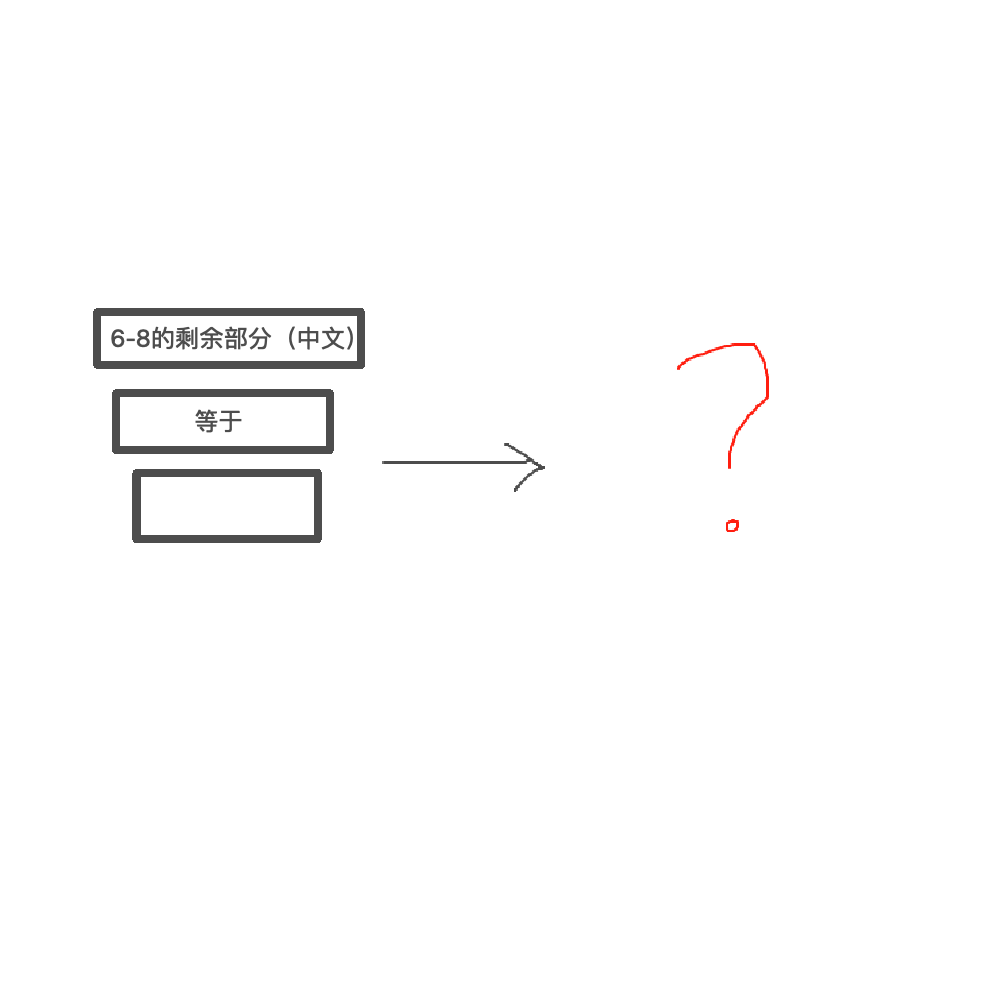

# 千字谜子题 111

## 题面

## 答案

`言`

## 解析

6-8 = 六减去八，剩下了“点横”这个部分，它与等号(=)和最下面的方框一起构成了言字

（很水的一道题

## 本地附件

- [915a6d17d82b451e80b261383a764f18.webp](../../../assets/static.cipherpuzzles.com/static/images/915a6d17d82b451e80b261383a764f18.webp)

来源：[https://ccbc16.cipherpuzzles.com/data/c16-qian-puzzle.json#cid=111](https://ccbc16.cipherpuzzles.com/data/c16-qian-puzzle.json#cid=111)
