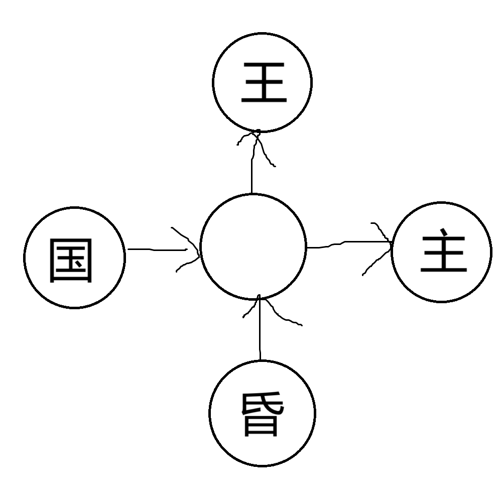

# 千字谜子题 112

## 题面

## 答案

`君`

## 解析

箭头表示可以组词，可以发现中间的圈只能填“君”

## 本地附件

- [bebf2a154523429eb1a0bc2102ca1e9f.webp](../../../assets/static.cipherpuzzles.com/static/images/bebf2a154523429eb1a0bc2102ca1e9f.webp)

来源：[https://ccbc16.cipherpuzzles.com/data/c16-qian-puzzle.json#cid=112](https://ccbc16.cipherpuzzles.com/data/c16-qian-puzzle.json#cid=112)
