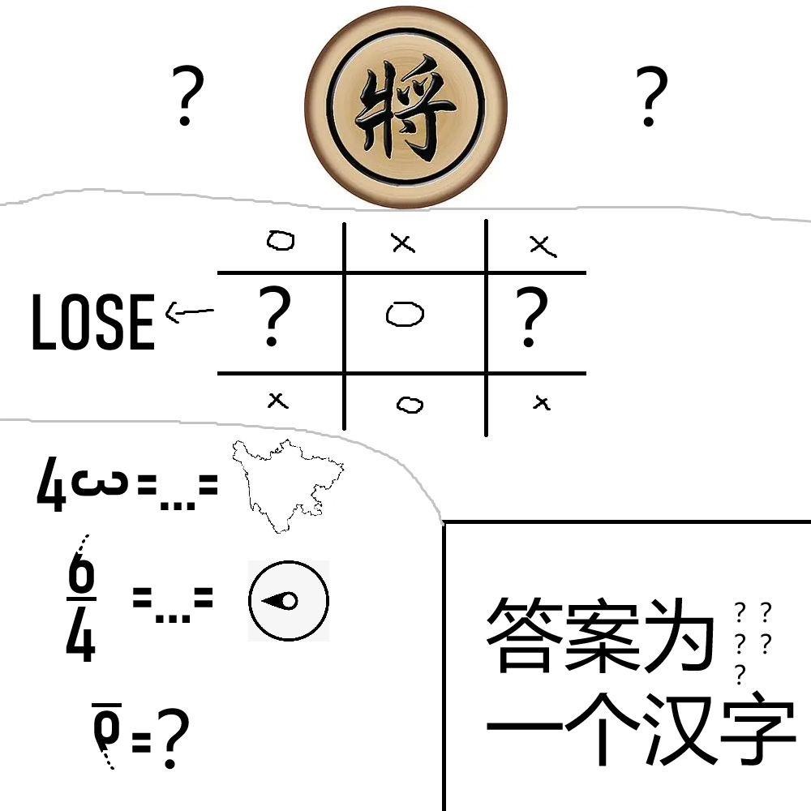

# 千字谜子题 114

## 题面

## 答案

`鼓`

## 解析

针对修改意见中提到的“表示组合还需斟酌；中间的OOXX不易确定；左下的6也比较抽象。”三个问题，我在右下角提示区域增加了提取的提示；重做了中间部分，增加了下部分的提示。本题将鼓字拆分为五个部分、上中下三个区域，用灰线隔开。上方的两个问号是“士”，因为象棋中“将”旁边是两个士。中间的两个问号是“O”和“X”，容易发现中间部分是井字棋，因为双方交替行棋，问号中要么是两个圈，要么是一个圈一个叉，又已知左边问号的棋子落败，可推知左边问号是圈，右边问号是叉。左下角第一行是四和九十度旋转的三组成四川，做题者容易想到，

## 本地附件

- [0b10334db12d4444be61f5c46a92686b.webp](../../../assets/static.cipherpuzzles.com/static/images/0b10334db12d4444be61f5c46a92686b.webp)

来源：[https://ccbc16.cipherpuzzles.com/data/c16-qian-puzzle.json#cid=114](https://ccbc16.cipherpuzzles.com/data/c16-qian-puzzle.json#cid=114)
