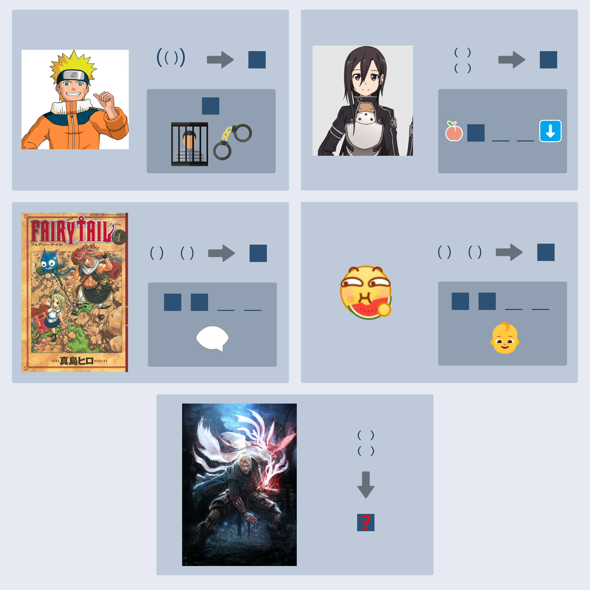

# 千字谜子题 115

## 题面

## 答案

`全`

## 解析

1. 图中所有的空分别为：
鸣人 -> 囚
桐子 -> 李 桃李满天下
妖尾 -> 娓 娓娓道来
吃瓜 -> 呱 呱呱坠/落地
仁王 -> 全

2. 解题过程
第一层 - 识图：百度识图可以解决所有问题
第二层 - 箭头转换规则：第一个字的偏旁 + 第二个字；括号的排列方式则是结果的字形结构（分别是包围结构、上下结构、左右结构、左右结构、上下结构）

3.一些设计小巧思：
- 鸣人->囚 和 桐子->李 的结果字通过提示比较容易猜出来，这两题给字形结构转换提供了两个例子，让仁王的左右变上下有理有据
-

## 本地附件

- [f3f82063229f49f59d8d2007002ea4bb.webp](../../../assets/static.cipherpuzzles.com/static/images/f3f82063229f49f59d8d2007002ea4bb.webp)

来源：[https://ccbc16.cipherpuzzles.com/data/c16-qian-puzzle.json#cid=115](https://ccbc16.cipherpuzzles.com/data/c16-qian-puzzle.json#cid=115)
