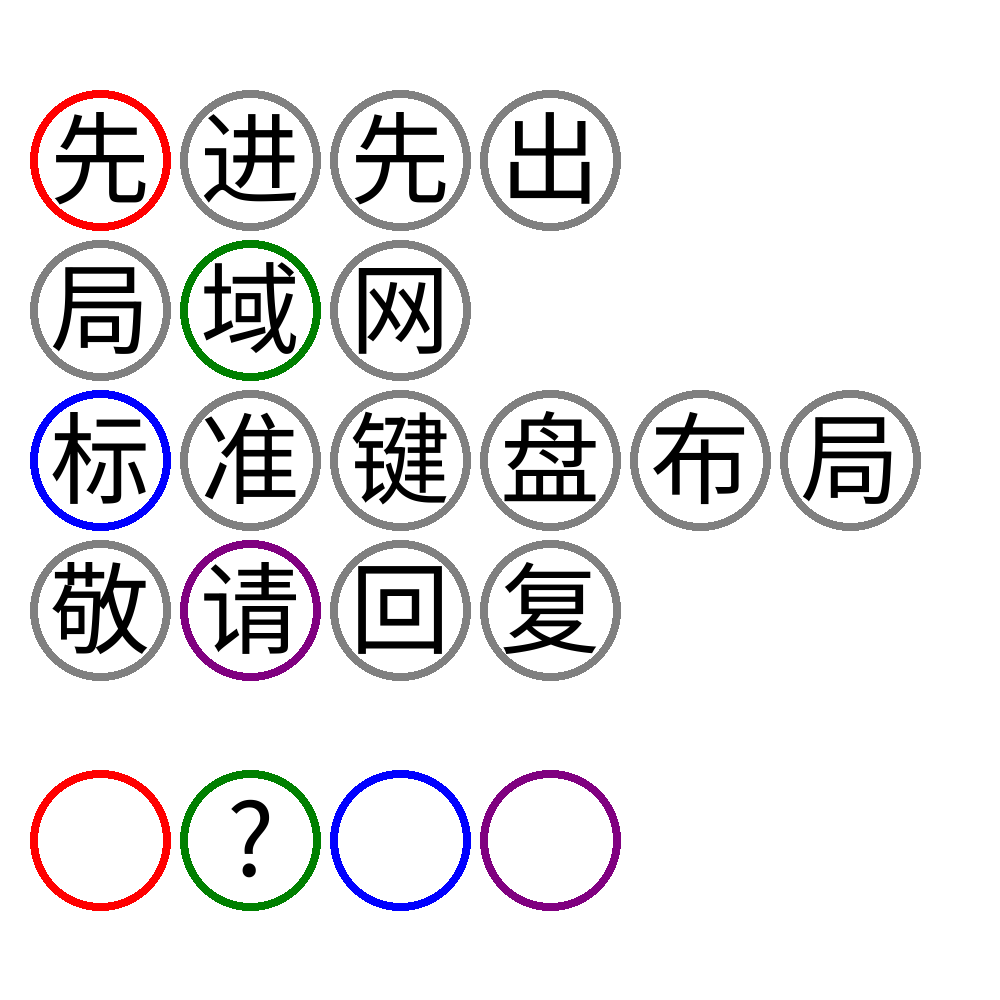

# 千字谜子题 117

## 题面

## 答案

`见`

## 解析

先进先出 = FIFO
局域网 = LAN
标准键盘布局 = QWERTY
敬请回复 = RSVP
FAQS = 常见问题
? = 见

## 本地附件

- [65839f7435e547f2baf7cf13e733dda0.webp](../../../assets/static.cipherpuzzles.com/static/images/65839f7435e547f2baf7cf13e733dda0.webp)

来源：[https://ccbc16.cipherpuzzles.com/data/c16-qian-puzzle.json#cid=117](https://ccbc16.cipherpuzzles.com/data/c16-qian-puzzle.json#cid=117)
