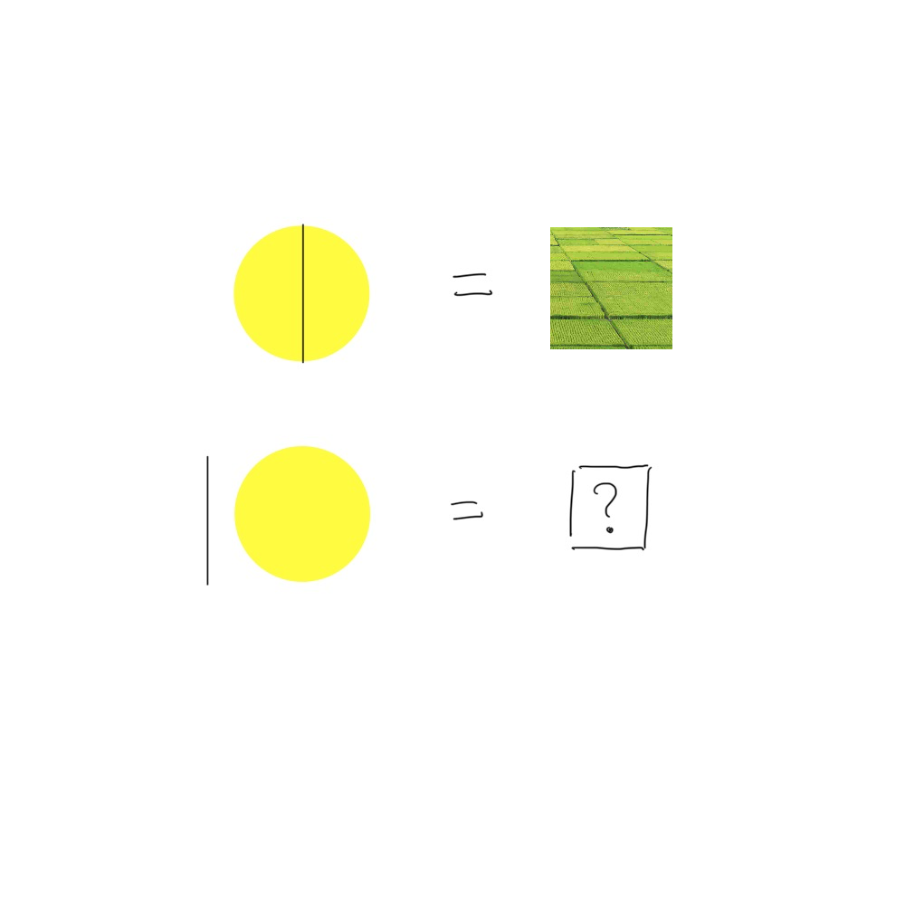

# 千字谜子题 118

## 题面

## 答案

`旧`

## 解析

由第一行可知 日中间加一竖得到田，黄色圆即代表 日 字
由第二行，日左边加一竖即得到答案 旧

## 本地附件

- [a82bdec0921c45deab050b53cb0bde69.webp](../../../assets/static.cipherpuzzles.com/static/images/a82bdec0921c45deab050b53cb0bde69.webp)

来源：[https://ccbc16.cipherpuzzles.com/data/c16-qian-puzzle.json#cid=118](https://ccbc16.cipherpuzzles.com/data/c16-qian-puzzle.json#cid=118)
