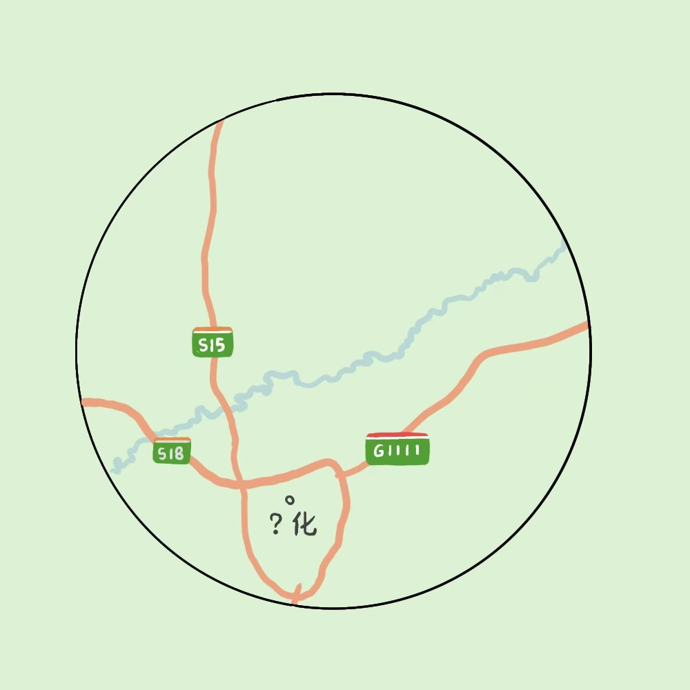

# 千字谜子题 119

## 题面

## 答案

`绥`

## 解析

根据图中几条高速名和河流走向可以推断出该城市为黑龙江省绥化市。

## 本地附件

- [dde345310e054553adb6f5ad38ea4366.webp](../../../assets/static.cipherpuzzles.com/static/images/dde345310e054553adb6f5ad38ea4366.webp)

来源：[https://ccbc16.cipherpuzzles.com/data/c16-qian-puzzle.json#cid=119](https://ccbc16.cipherpuzzles.com/data/c16-qian-puzzle.json#cid=119)
