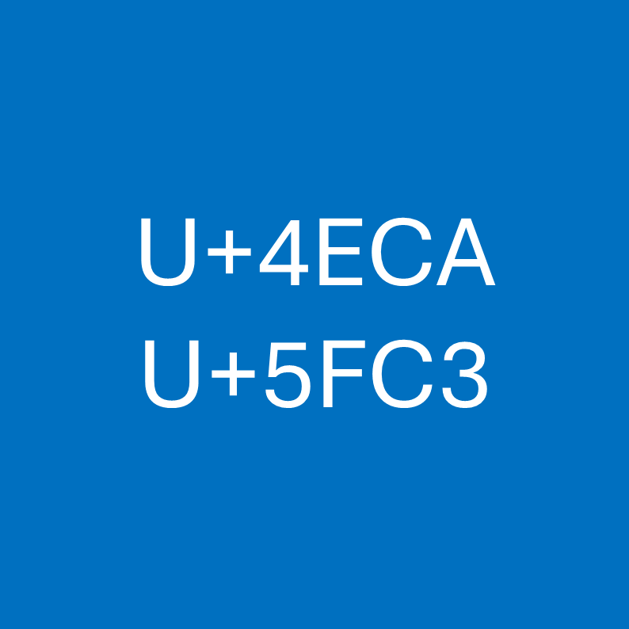

# 千字谜子题 12

## 题面

## 答案

`念`

## 解析

_官方存档未填写解析。_

## 本地附件

- [e6b2843d4d49413d84e2aa361de19a98.webp](../../../assets/static.cipherpuzzles.com/static/images/e6b2843d4d49413d84e2aa361de19a98.webp)

来源：[https://ccbc16.cipherpuzzles.com/data/c16-qian-puzzle.json#cid=12](https://ccbc16.cipherpuzzles.com/data/c16-qian-puzzle.json#cid=12)
