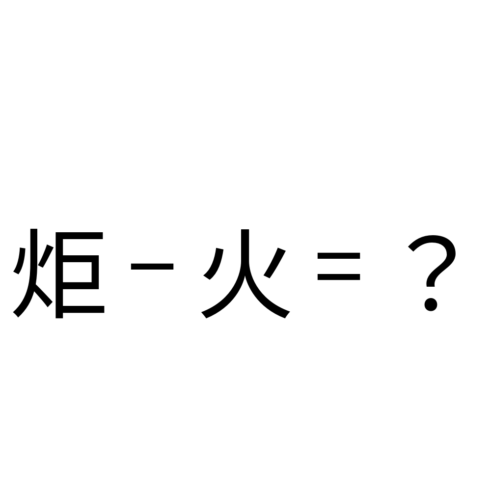

# 千字谜子题 120

## 题面

## 答案

`巨`

## 解析

这下不难了把

## 本地附件

- [94f8dbfb774e429ea9619ce985160e41.webp](../../../assets/static.cipherpuzzles.com/static/images/94f8dbfb774e429ea9619ce985160e41.webp)

来源：[https://ccbc16.cipherpuzzles.com/data/c16-qian-puzzle.json#cid=120](https://ccbc16.cipherpuzzles.com/data/c16-qian-puzzle.json#cid=120)
