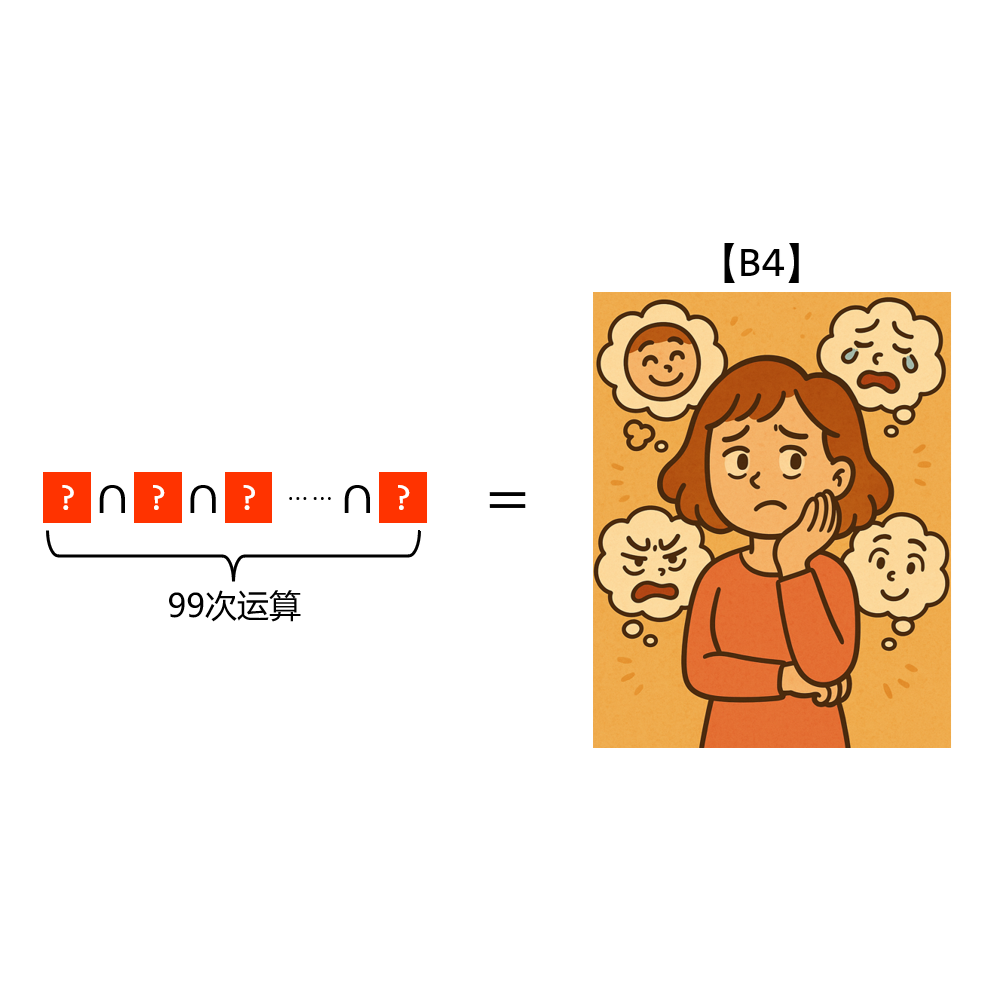

# 千字谜子题 121

## 题面

## 答案

`感`

## 解析

两边描述的都是成语百感交集，所以❓为“感”，令人忍俊不禁。（图片来自GPT）

## 本地附件

- [1428318b50f246a184c8427fbc7ca6a8.webp](../../../assets/static.cipherpuzzles.com/static/images/1428318b50f246a184c8427fbc7ca6a8.webp)

来源：[https://ccbc16.cipherpuzzles.com/data/c16-qian-puzzle.json#cid=121](https://ccbc16.cipherpuzzles.com/data/c16-qian-puzzle.json#cid=121)
