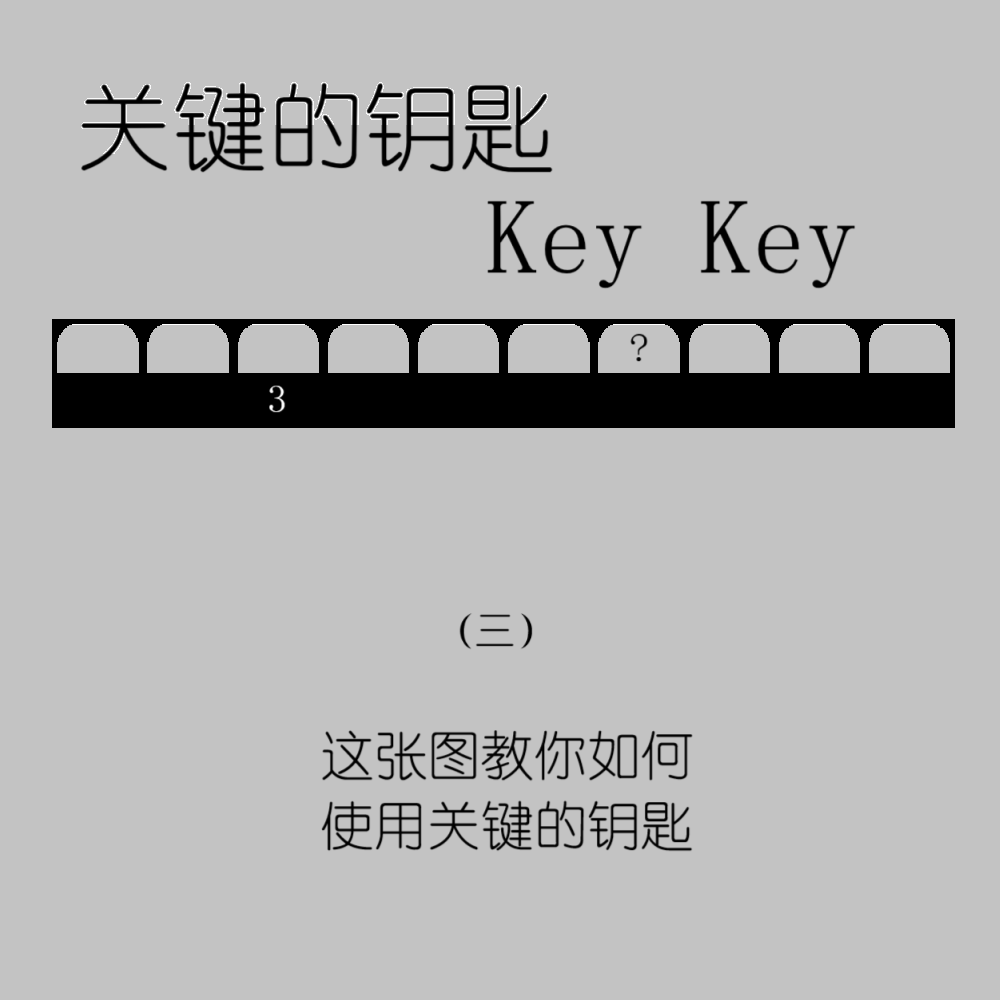

# 千字谜子题 122

## 题面

## 答案

`与`

## 解析

题目「关键的钥匙」的英文翻译是 Key Key，而 Key 有「关键的」、「钥匙」和「按键」的含义。结合图片中 3 的位置，可以联想到键盘的数字键。在数字键上，问号位置对应 Shift+7，也就是「&」。再结合提示（三），可知答案是汉字「与」。

## 本地附件

- [b481e70b884a4d5f9215ab32dd22bfb9.webp](../../../assets/static.cipherpuzzles.com/static/images/b481e70b884a4d5f9215ab32dd22bfb9.webp)

来源：[https://ccbc16.cipherpuzzles.com/data/c16-qian-puzzle.json#cid=122](https://ccbc16.cipherpuzzles.com/data/c16-qian-puzzle.json#cid=122)
