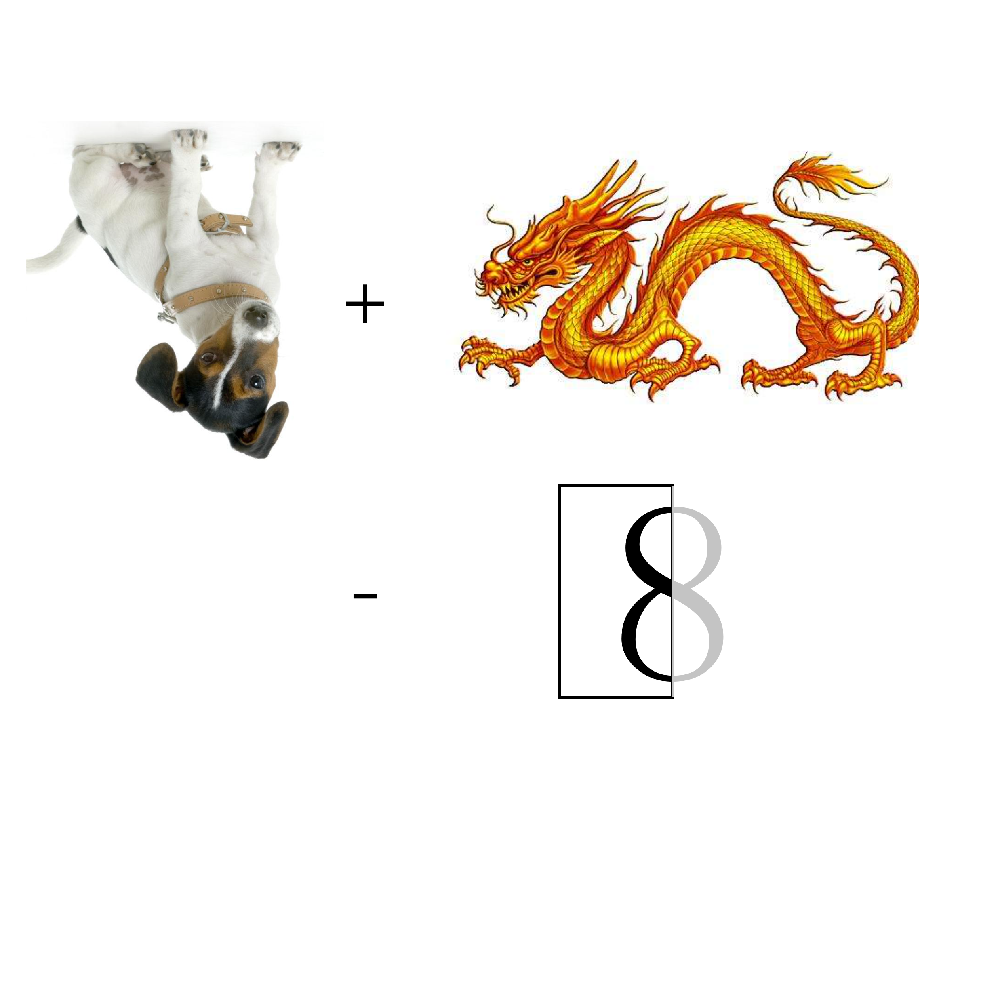

# 千字谜子题 123

## 题面

## 答案

`犹`

## 解析

反犬+龙-八的左边（一撇）

## 本地附件

- [9cfc06cb97ea40cb8d82a6014541115b.webp](../../../assets/static.cipherpuzzles.com/static/images/9cfc06cb97ea40cb8d82a6014541115b.webp)

来源：[https://ccbc16.cipherpuzzles.com/data/c16-qian-puzzle.json#cid=123](https://ccbc16.cipherpuzzles.com/data/c16-qian-puzzle.json#cid=123)
