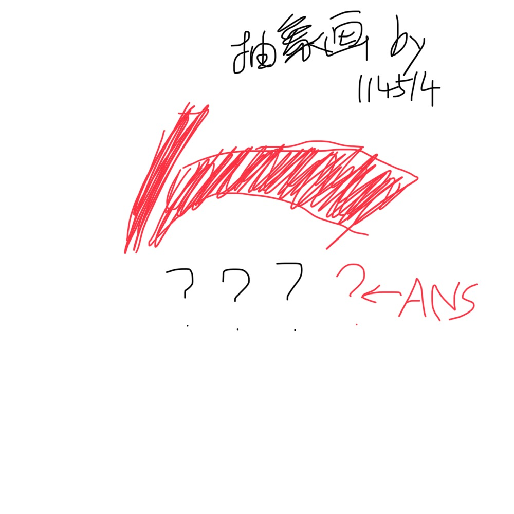

# 千字谜子题 125

## 题面

## 答案

`宁`

## 解析

这是中国李宁的图标。按下方空格填入得到答案是“宁”。

## 本地附件

- [408c41fcffb44765871b2d4cf18d5201.webp](../../../assets/static.cipherpuzzles.com/static/images/408c41fcffb44765871b2d4cf18d5201.webp)

来源：[https://ccbc16.cipherpuzzles.com/data/c16-qian-puzzle.json#cid=125](https://ccbc16.cipherpuzzles.com/data/c16-qian-puzzle.json#cid=125)
