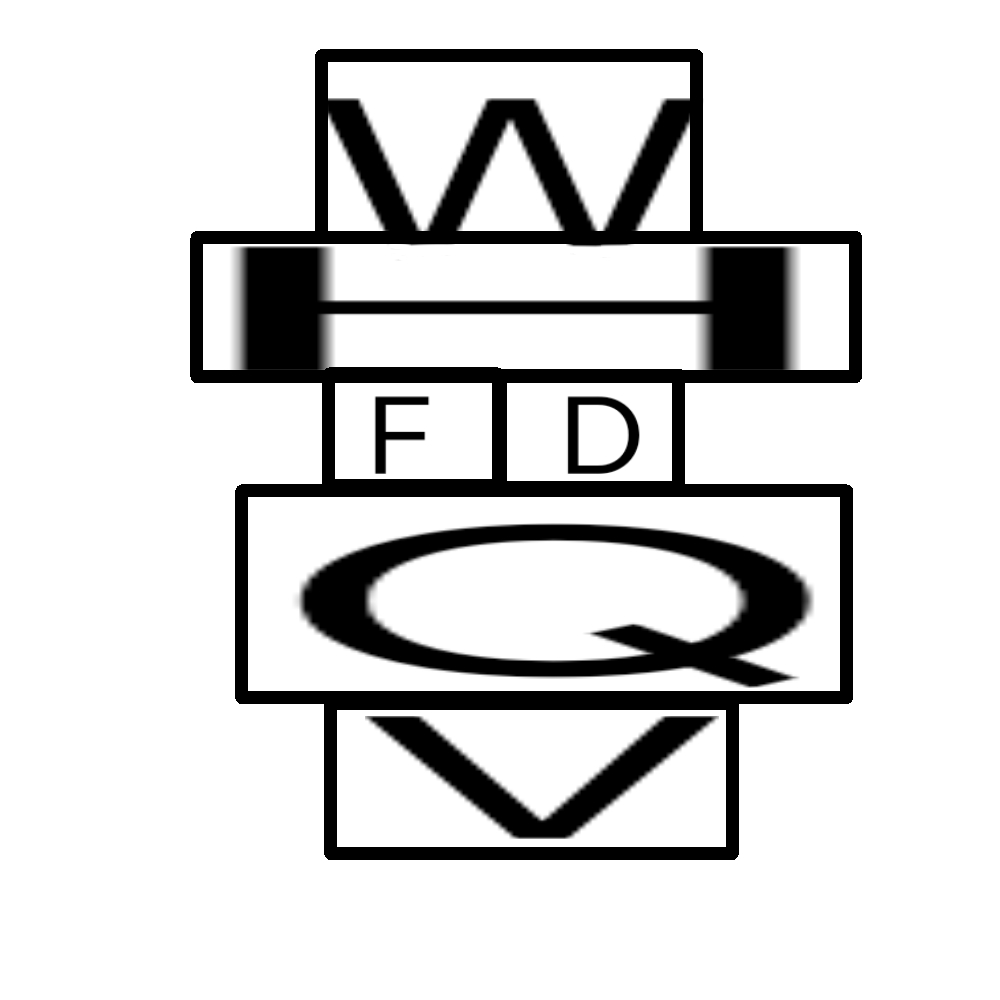

# 千字谜子题 126

## 题面

## 答案

`赏`

## 解析

猪圈后象形

## 本地附件

- [5381498fd34c4176a0c9a4b7d2ed5410.webp](../../../assets/static.cipherpuzzles.com/static/images/5381498fd34c4176a0c9a4b7d2ed5410.webp)

来源：[https://ccbc16.cipherpuzzles.com/data/c16-qian-puzzle.json#cid=126](https://ccbc16.cipherpuzzles.com/data/c16-qian-puzzle.json#cid=126)
