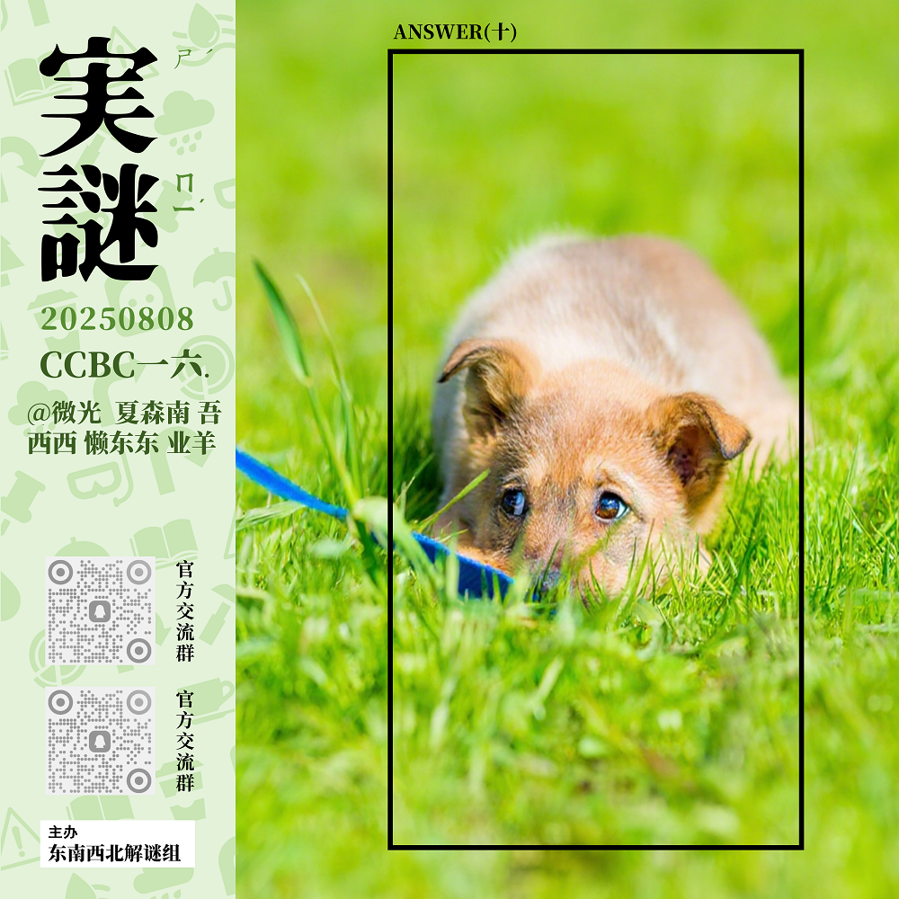

# 千字谜子题 127

## 题面

## 答案

`莽`

## 解析

模仿LILAC实谜格式，提取框内两个草字头和一个犬，答案为莽

## 本地附件

- [d191e9ff256f4054a75bb87567cbec4b.webp](../../../assets/static.cipherpuzzles.com/static/images/d191e9ff256f4054a75bb87567cbec4b.webp)

来源：[https://ccbc16.cipherpuzzles.com/data/c16-qian-puzzle.json#cid=127](https://ccbc16.cipherpuzzles.com/data/c16-qian-puzzle.json#cid=127)
