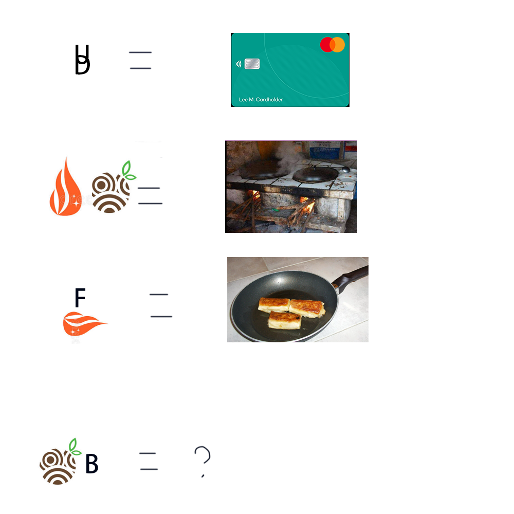

# 千字谜子题 128

## 题面

## 答案

`垢`

## 解析

两个图标代表火和土，UDLRFB代表上下左右前后（魔方），三个样例答案分别为卡，灶，煎，因此答案为垢(对于煎,其中"灬"（读huǒ，biāo）是一个汉语汉字。为火的偏旁异写之一。又指烈火。)

## 本地附件

- [1b52534540e5461789e6d6fa5a3fc97a.webp](../../../assets/static.cipherpuzzles.com/static/images/1b52534540e5461789e6d6fa5a3fc97a.webp)

来源：[https://ccbc16.cipherpuzzles.com/data/c16-qian-puzzle.json#cid=128](https://ccbc16.cipherpuzzles.com/data/c16-qian-puzzle.json#cid=128)
