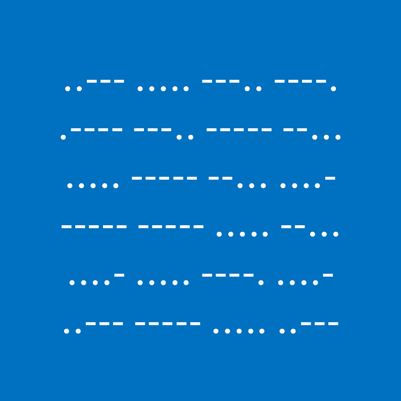

# 千字谜子题 13

## 题面

## 答案

`竟`

## 解析

_官方存档未填写解析。_

## 本地附件

- [354a87ee447c444db7e04df91282bc55.webp](../../../assets/static.cipherpuzzles.com/static/images/354a87ee447c444db7e04df91282bc55.webp)

来源：[https://ccbc16.cipherpuzzles.com/data/c16-qian-puzzle.json#cid=13](https://ccbc16.cipherpuzzles.com/data/c16-qian-puzzle.json#cid=13)
