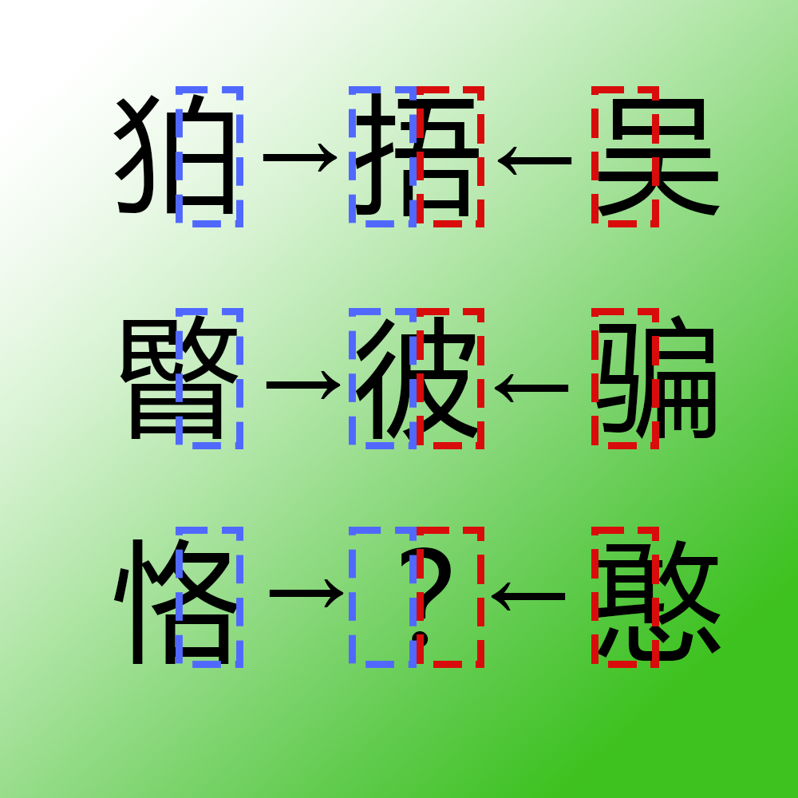

# 千字谜子题 130

## 题面

这些字都是怎么编码输入的？

## 答案

`号`

## 解析

本题使用五笔将汉字拆成四个字母，绿白背景暗示搜狗五笔输入法，上面两个示范中间的文字谐音“五笔”。
上面六个字的五笔编码分别为
qtrg，rgkg，kgdu 
nath，thcy，cyna 
可以发现中间字的五笔编码取自左右两边汉字
同理，最下面的两个汉字分别为ntkg和nbtn，提取得到kgnb即“号”

## 本地附件

- [ddbc415c538c42a99beeb8d79720f48d.webp](../../../assets/static.cipherpuzzles.com/static/images/ddbc415c538c42a99beeb8d79720f48d.webp)

来源：[https://ccbc16.cipherpuzzles.com/data/c16-qian-puzzle.json#cid=130](https://ccbc16.cipherpuzzles.com/data/c16-qian-puzzle.json#cid=130)
