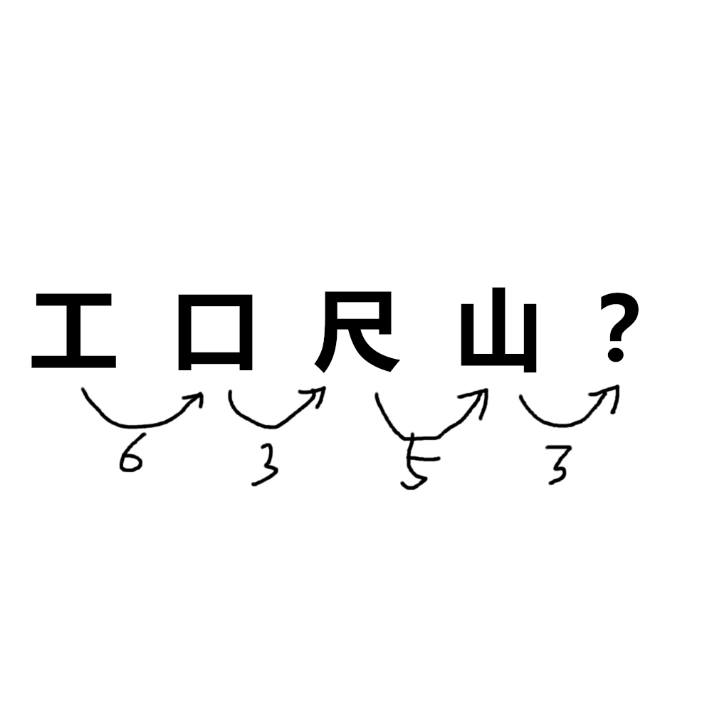

# 千字谜子题 131

## 题面

（三）

## 答案

`之`

## 解析

汉字象形成字母，再A1Z26
工=I=9
口=O=15(9+3=15)
尺=R=18(15+3=18)
山=W=23(18+5=23)
之=Z=26(23+3=26)

## 本地附件

- [6b738c5d4f0d47e4812e5a0dad637d29.webp](../../../assets/static.cipherpuzzles.com/static/images/6b738c5d4f0d47e4812e5a0dad637d29.webp)

来源：[https://ccbc16.cipherpuzzles.com/data/c16-qian-puzzle.json#cid=131](https://ccbc16.cipherpuzzles.com/data/c16-qian-puzzle.json#cid=131)
