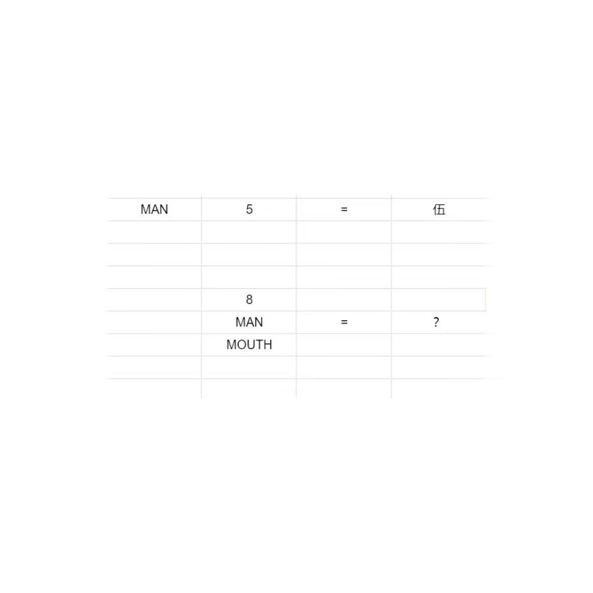

# 千字谜子题 132

## 题面

## 答案

`谷`

## 解析

人+五就是伍，所以八+人+口就是谷

## 本地附件

- [463b6c96038e47ceb9acc5d3405f29f1.webp](../../../assets/static.cipherpuzzles.com/static/images/463b6c96038e47ceb9acc5d3405f29f1.webp)

来源：[https://ccbc16.cipherpuzzles.com/data/c16-qian-puzzle.json#cid=132](https://ccbc16.cipherpuzzles.com/data/c16-qian-puzzle.json#cid=132)
