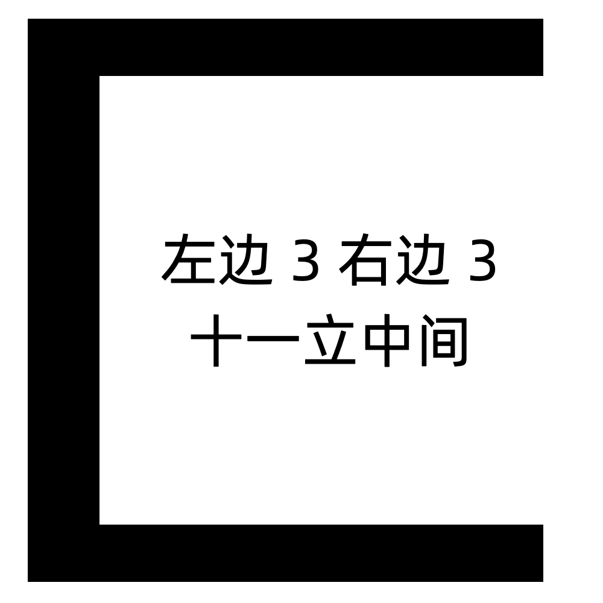

# 千字谜子题 133

## 题面

## 答案

`匪`

## 解析

中间是个字谜，答案是“非”，加上外框合成“匪”字

## 本地附件

- [080c97883a9345adaeedc5b290796f87.webp](../../../assets/static.cipherpuzzles.com/static/images/080c97883a9345adaeedc5b290796f87.webp)

来源：[https://ccbc16.cipherpuzzles.com/data/c16-qian-puzzle.json#cid=133](https://ccbc16.cipherpuzzles.com/data/c16-qian-puzzle.json#cid=133)
