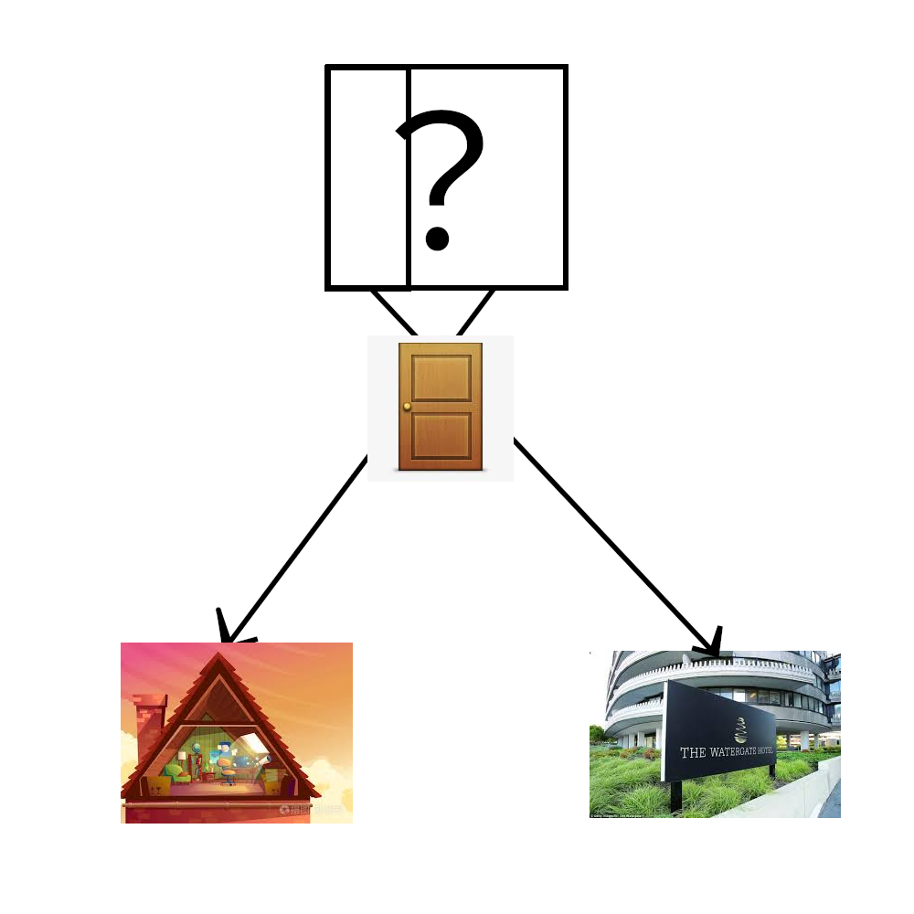

# 千字谜子题 134

## 题面

## 答案

`洛`

## 解析

题目：极简四方谜
这道题先分析题目元素，左下角是阁楼，右下角是水门饭店，中间是一个门，上方是我们需要猜测的字。可以看到上面的字分为了两个部分，分别加上了门组成了左下角和右下角的元素。左下角的阁去掉门就是各，而右下角的水门去掉门是水，在字里面以三点水形式存在，于是得到洛字

## 本地附件

- [aa0249be009241a59da568a933c86a09.webp](../../../assets/static.cipherpuzzles.com/static/images/aa0249be009241a59da568a933c86a09.webp)

来源：[https://ccbc16.cipherpuzzles.com/data/c16-qian-puzzle.json#cid=134](https://ccbc16.cipherpuzzles.com/data/c16-qian-puzzle.json#cid=134)
