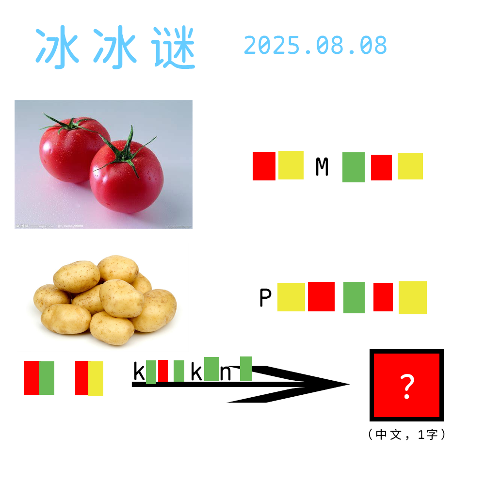

# 千字谜子题 135

## 题面

## 答案

`外`

## 解析

番茄 TOMATO
土豆 POTATO
TA TO 片假名→ タト→外

## 本地附件

- [62bdf182db294353a25f2ce7abe3be39.webp](../../../assets/static.cipherpuzzles.com/static/images/62bdf182db294353a25f2ce7abe3be39.webp)

来源：[https://ccbc16.cipherpuzzles.com/data/c16-qian-puzzle.json#cid=135](https://ccbc16.cipherpuzzles.com/data/c16-qian-puzzle.json#cid=135)
