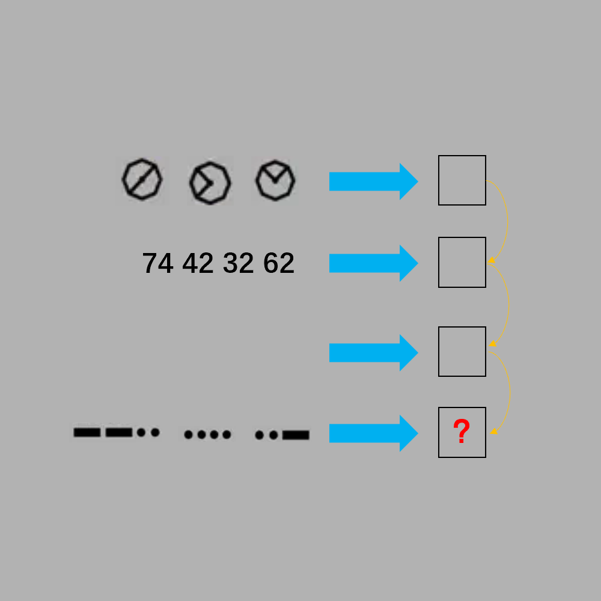

# 千字谜子题 136

## 题面

## 答案

`主`

## 解析

第一排旗语→liu；第二排九键→shen；第三排什么也没有，代表无；第四排摩斯密码→主。黄色箭头表明每排得到的结果可以连在一起，结合题目，能想到成语“六神无主”，问号处提取答案“主”。

## 本地附件

- [0b212b3cb8b34ba7a50daffed0fd9b50.webp](../../../assets/static.cipherpuzzles.com/static/images/0b212b3cb8b34ba7a50daffed0fd9b50.webp)

来源：[https://ccbc16.cipherpuzzles.com/data/c16-qian-puzzle.json#cid=136](https://ccbc16.cipherpuzzles.com/data/c16-qian-puzzle.json#cid=136)
