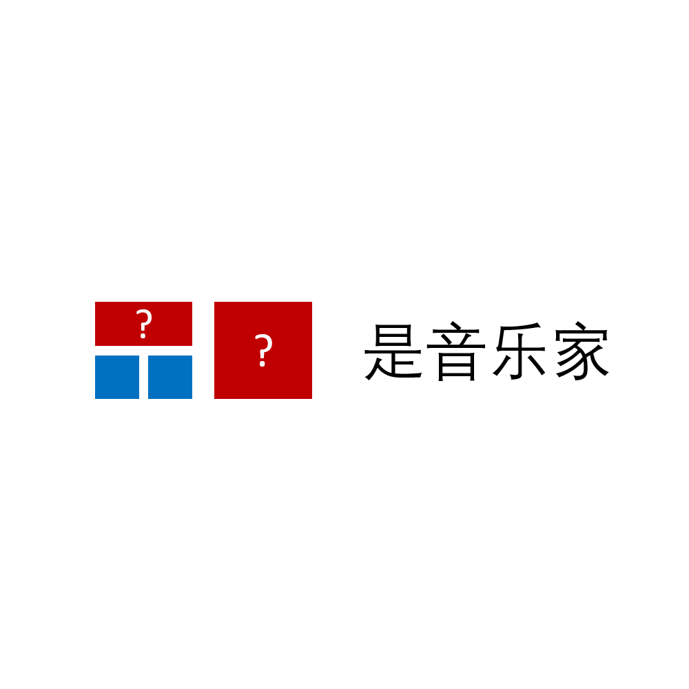

# 千字谜子题 137

## 题面

## 答案

`耳`

## 解析

同色的方块代表相同的部件，这里可以填入“聂耳”是音乐家，所以答案是问号处的字“耳”

## 本地附件

- [a984f5fb4e40411ab72ebd285f264f42.webp](../../../assets/static.cipherpuzzles.com/static/images/a984f5fb4e40411ab72ebd285f264f42.webp)

来源：[https://ccbc16.cipherpuzzles.com/data/c16-qian-puzzle.json#cid=137](https://ccbc16.cipherpuzzles.com/data/c16-qian-puzzle.json#cid=137)
