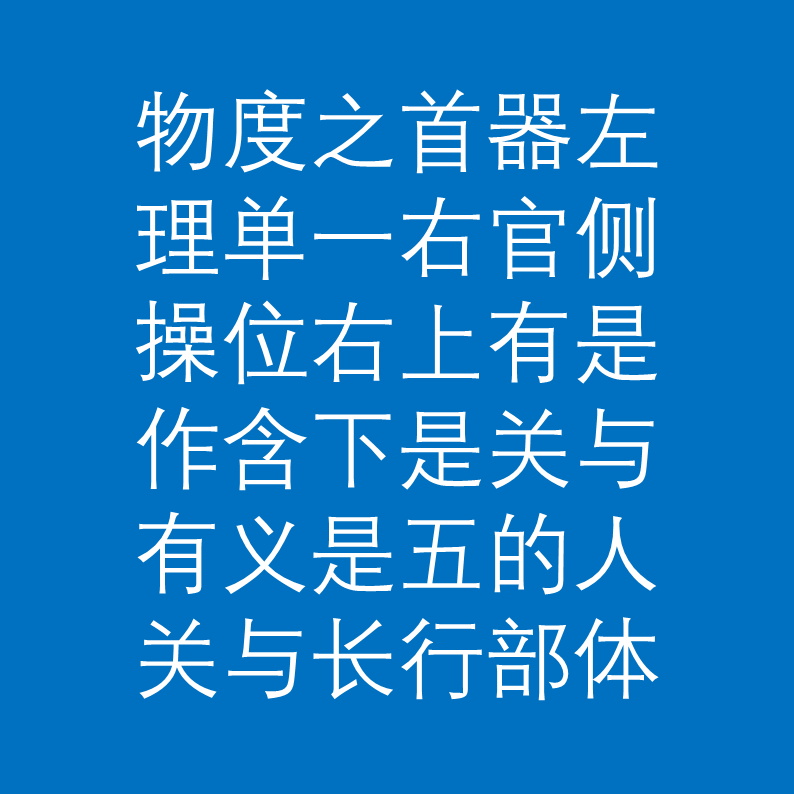

# 千字谜子题 14

## 题面

## 答案

`持`

## 解析

_官方存档未填写解析。_

## 本地附件

- [6e6aac2b7b2642e9af82f1a2ae76ef87.webp](../../../assets/static.cipherpuzzles.com/static/images/6e6aac2b7b2642e9af82f1a2ae76ef87.webp)

来源：[https://ccbc16.cipherpuzzles.com/data/c16-qian-puzzle.json#cid=14](https://ccbc16.cipherpuzzles.com/data/c16-qian-puzzle.json#cid=14)
