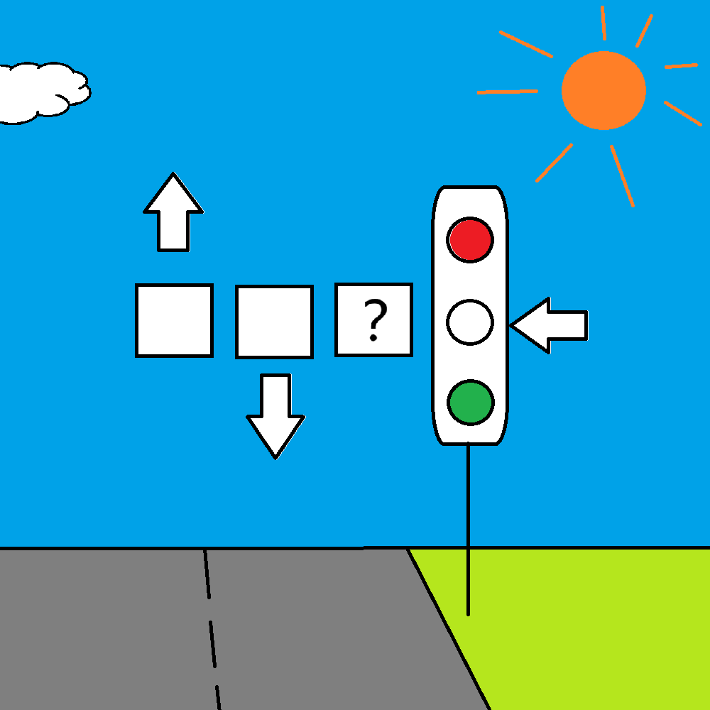

# 千字谜子题 140

## 题面

## 答案

`玄`

## 解析

方框表示汉字，前两个方框的字由箭头分别指示天和地，后面是一个红绿灯，箭头指示其中黄灯的位置，”天地？黄“，可通过千字文推测问号表示”玄“字。

## 本地附件

- [3ea60958aa014f4795fe6848afb7b052.webp](../../../assets/static.cipherpuzzles.com/static/images/3ea60958aa014f4795fe6848afb7b052.webp)

来源：[https://ccbc16.cipherpuzzles.com/data/c16-qian-puzzle.json#cid=140](https://ccbc16.cipherpuzzles.com/data/c16-qian-puzzle.json#cid=140)
