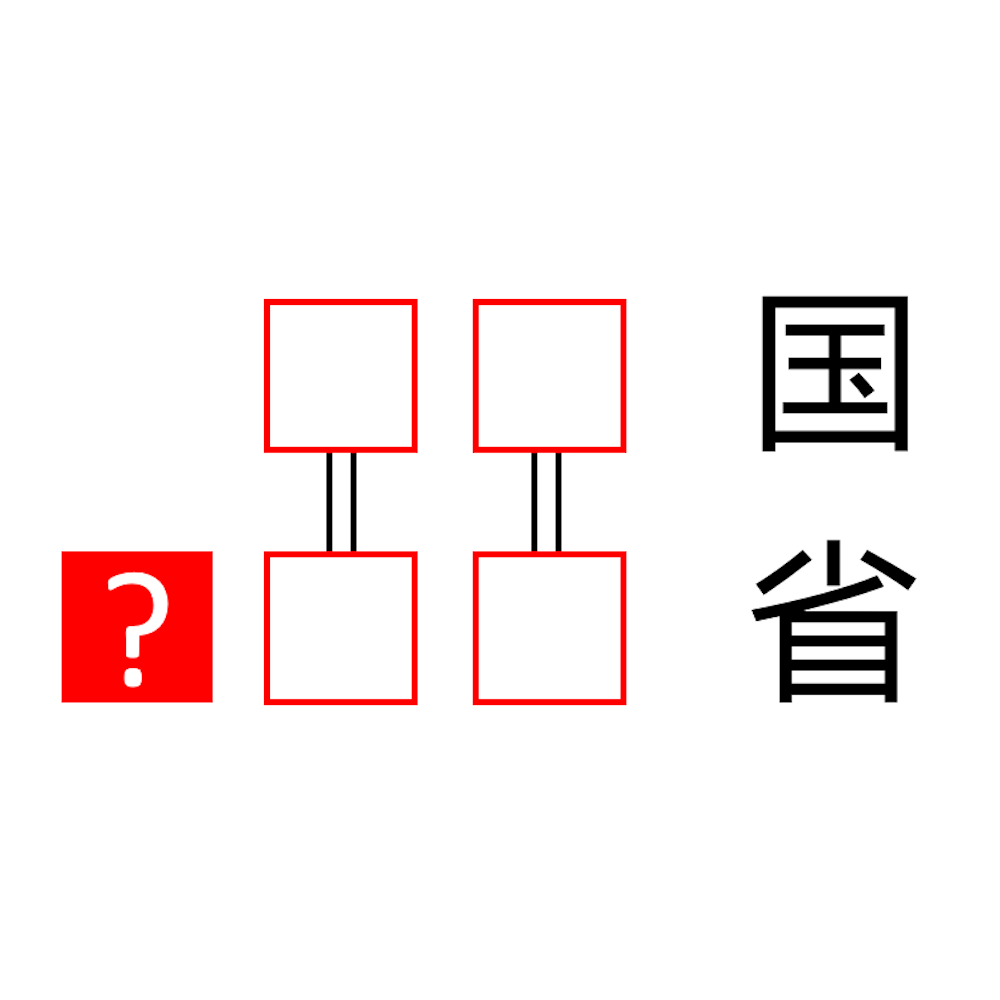

# 千字谜子题 141

## 题面

## 答案

`内`

## 解析

第一行要填入一个国家，第二行要填入一个省级行政区，然后第一行的两个字和第二行的后两个字相等，这就容易联想到蒙古和内蒙古，提取红色框的答案，就是“内”

## 本地附件

- [a80b77dddc494ee98ca97cfbfa5c00cf.webp](../../../assets/static.cipherpuzzles.com/static/images/a80b77dddc494ee98ca97cfbfa5c00cf.webp)

来源：[https://ccbc16.cipherpuzzles.com/data/c16-qian-puzzle.json#cid=141](https://ccbc16.cipherpuzzles.com/data/c16-qian-puzzle.json#cid=141)
