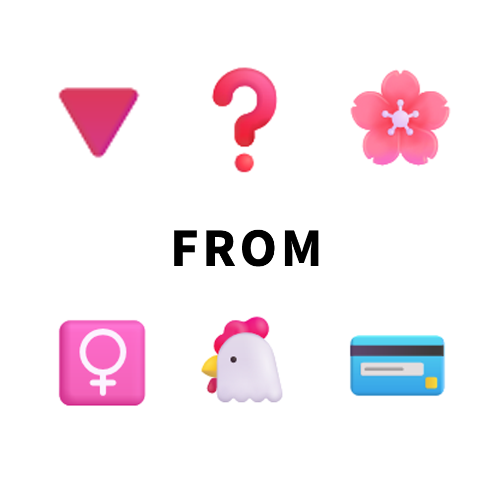

# 千字谜子题 142

## 题面

## 答案

`初`

## 解析

来自Ave Mujika（母鸡卡）的三角“初”华，采用Emoji表示题目令人忍俊不禁。

## 本地附件

- [94b01b00bdef4890a3d128d4e0175b57.webp](../../../assets/static.cipherpuzzles.com/static/images/94b01b00bdef4890a3d128d4e0175b57.webp)

来源：[https://ccbc16.cipherpuzzles.com/data/c16-qian-puzzle.json#cid=142](https://ccbc16.cipherpuzzles.com/data/c16-qian-puzzle.json#cid=142)
