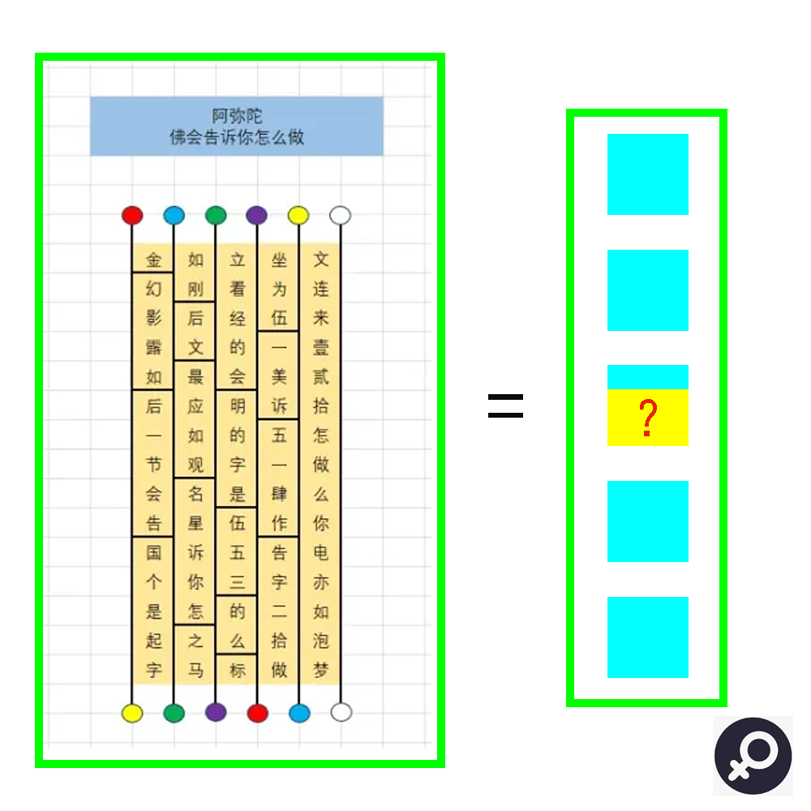

# 千字谜子题 143

## 题面

## 答案

`连`

## 解析

使用阿弥陀佛签提取文字，得到后面的指示。找到金刚经最后一节的“如梦幻泡影。如露亦如电。应作如是观。”于是得知需要将后面的汉字重新排序，以头尾依次读取重排即可。随后根据后续指示提取文字，得到答案是女明星“玛丽莲梦露”。最后提取连。
ps：回复疑问，鬼脚图用于提取其在右侧的文字。

## 本地附件

- [5611e52df4354626adb45a624f95ea74.webp](../../../assets/static.cipherpuzzles.com/static/images/5611e52df4354626adb45a624f95ea74.webp)

来源：[https://ccbc16.cipherpuzzles.com/data/c16-qian-puzzle.json#cid=143](https://ccbc16.cipherpuzzles.com/data/c16-qian-puzzle.json#cid=143)
