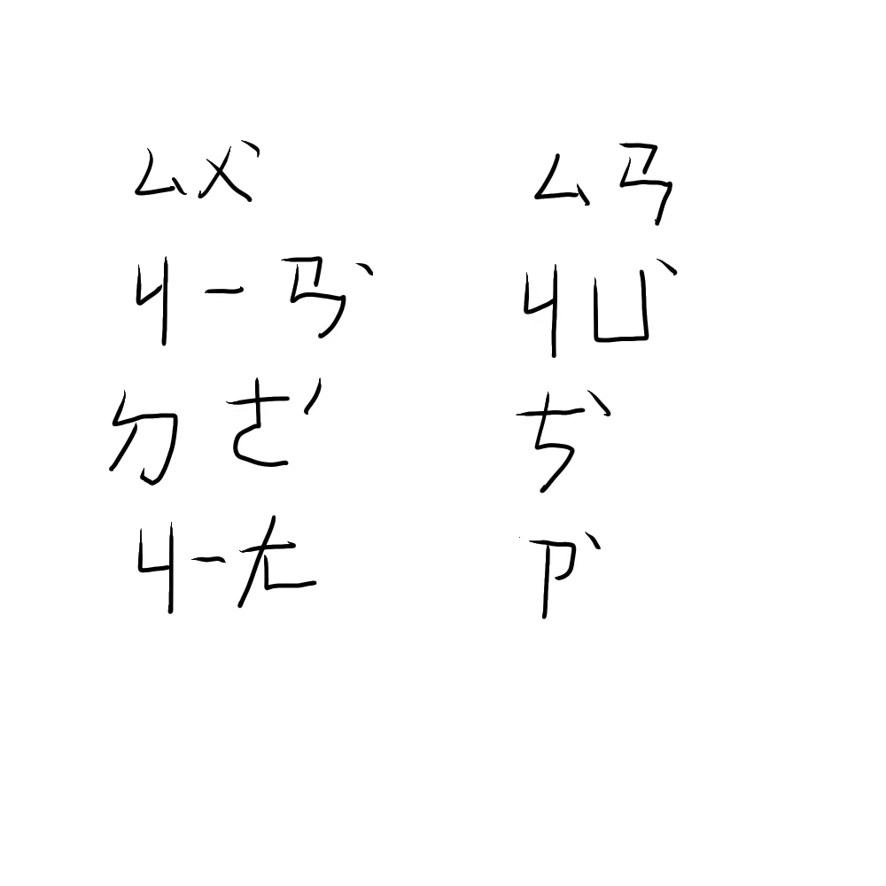

# 千字谜子题 146

## 题面

## 答案

`旷`

## 解析

本谜题采用了注音的加密方法。注音顾名思义，是标注汉语汉字的读音，目前仅台湾部分地区还在使用，故将其作为一种加密方式。图中是“宿建德江三句次字”的注音写法。《宿建德江》的三、四句是“野旷天低树，江清月近人”，三句次字即为旷。

## 本地附件

- [76f7d3314cfa4b7ca02d349f56cf3532.webp](../../../assets/static.cipherpuzzles.com/static/images/76f7d3314cfa4b7ca02d349f56cf3532.webp)

来源：[https://ccbc16.cipherpuzzles.com/data/c16-qian-puzzle.json#cid=146](https://ccbc16.cipherpuzzles.com/data/c16-qian-puzzle.json#cid=146)
