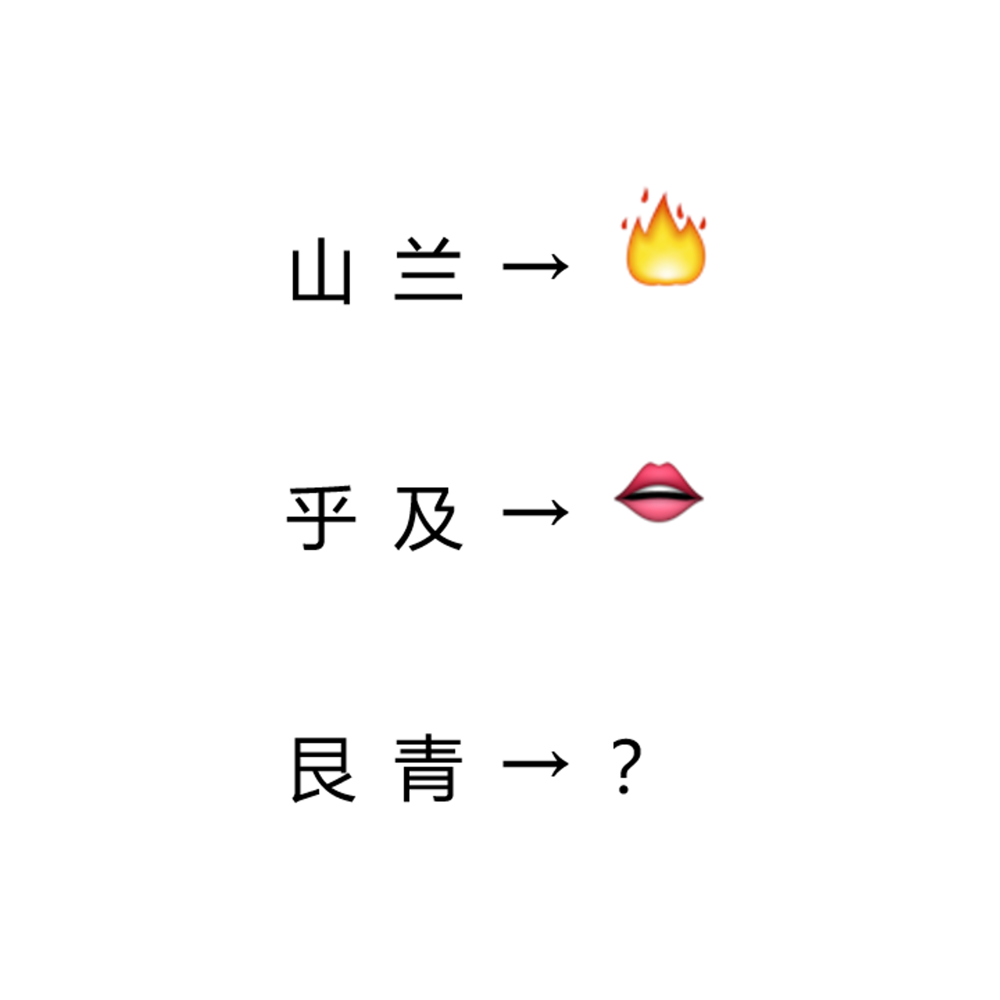

# 千字谜子题 147

## 题面

## 答案

`目`

## 解析

右边是偏旁，可以和左边组成词语
前面是灿烂，呼吸。
最后一个是目，组成眼睛

## 本地附件

- [3f342f763c61427081a1f75bfdddf824.webp](../../../assets/static.cipherpuzzles.com/static/images/3f342f763c61427081a1f75bfdddf824.webp)

来源：[https://ccbc16.cipherpuzzles.com/data/c16-qian-puzzle.json#cid=147](https://ccbc16.cipherpuzzles.com/data/c16-qian-puzzle.json#cid=147)
