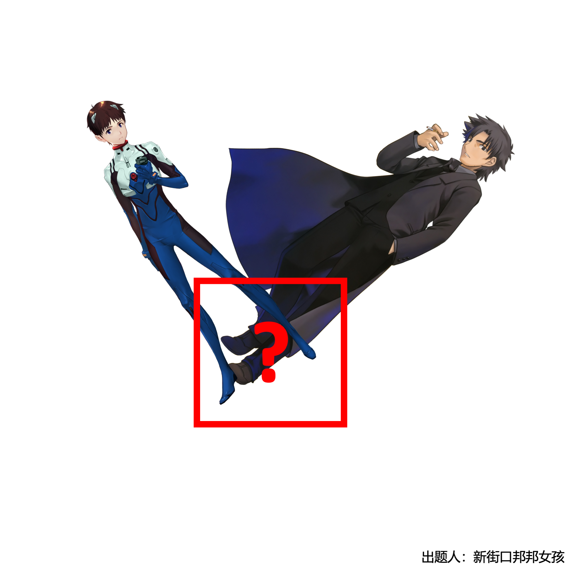

# 千字谜子题 148

## 题面

## 答案

`嗣`

## 解析

碇真嗣&卫宫切嗣

## 本地附件

- [a66de3ce5722441c9c73f7c9f67685f1.webp](../../../assets/static.cipherpuzzles.com/static/images/a66de3ce5722441c9c73f7c9f67685f1.webp)

来源：[https://ccbc16.cipherpuzzles.com/data/c16-qian-puzzle.json#cid=148](https://ccbc16.cipherpuzzles.com/data/c16-qian-puzzle.json#cid=148)
